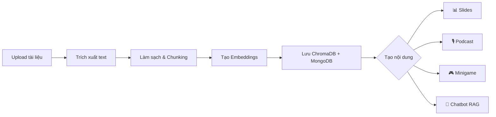

<div align="center">

  

  <a href="https://github.com/Kietnehi/AI-FOR-EDUCATION">
    
  </a>

  <br/><br/>

  <a href="https://github.com/Kietnehi/AI-FOR-EDUCATION/stargazers">
    
  </a>

  <a href="https://github.com/Kietnehi/AI-FOR-EDUCATION/network/members">
    
  </a>

  <a href="https://github.com/Kietnehi/AI-FOR-EDUCATION/issues">
    
  </a>

  <a href="https://github.com/Kietnehi/AI-FOR-EDUCATION/pulls">
    
  </a>

  <a href="https://github.com/Kietnehi/AI-FOR-EDUCATION/blob/main/LICENSE">
    
  </a>

  <br/><br/>

  <a href="https://skillicons.dev">
    
  </a>

  <br/><br/>

  &nbsp;&nbsp;&nbsp;
  

  <br/><br/>

</div>


# 🎓 AI Learning Studio — Nền tảng AI Tạo Học Liệu Số

**Nền tảng MVP production-ready giúp giáo viên và học sinh tạo nội dung học tập thông minh bằng AI. Chỉ cần tải tài liệu lên, hệ thống sẽ tự động tạo slide, podcast, minigame và chatbot hỏi đáp trong vài phút.**

Đây là hệ thống AI Agent đa phương thức (Multimodal RAG) toàn diện, được thiết kế theo kiến trúc vi dịch vụ (microservices) và triển khai hoàn toàn bằng **Docker**.

Dự án được chia thành 2 luồng xử lý chính:

  * **Chatbot for Student:** Trợ lý ảo hỗ trợ học tập trực tiếp. Hệ thống tự động trích xuất tri thức từ tài liệu (PDF, Word, Excel) và sử dụng các LLM (OpenAI, Gemini) để giải đáp thắc mắc của học sinh một cách chính xác.
  * **AI Worker Service:** Trái tim của hệ thống, xử lý các tác vụ nền tảng phức tạp được điều phối bởi **FastAPI** và quản lý trạng thái qua **MongoDB**. Phân hệ này có khả năng xử lý đầu vào đa phương thức (nhận diện giọng nói bằng Whisper, đọc ảnh bằng OCR), kết hợp tìm kiếm web (Tavily) để tự động hóa việc tạo ra các học liệu trực quan như: Slide bài giảng, Video, Infographic, âm thanh (TTS) và tự động chấm điểm (SCORE).

**🛠 Công nghệ cốt lõi:** FastAPI, Node.js, MongoDB, Hệ sinh thái Vector DB (Chroma, Pinecone, Milvus), và đa dạng mô hình AI (LLM, Hugging Face).
## Tính năng chính

- 📊 **Tạo slide bài giảng** `.pptx` tự động bằng `python-pptx`
- 🎙️ **Tạo podcast script** với cấu trúc speaker/timeline (có placeholder cho TTS)
- 🎮 **Tạo minigame/quiz** tương tác (trắc nghiệm, điền từ, flashcard, ghép cặp)
- 🤖 **Chatbot RAG** hỏi đáp theo học liệu với citations từ nguồn gốc
- 🎤 **Speech-to-Text cho Chatbot**: ghi âm bằng mic và chuyển giọng nói thành chữ
  - Local: `openai-whisper` model `base`
  - Cloud: Groq `whisper-large-v3` hoặc `whisper-large-v3-turbo`
- 🌙 **Dark mode** hoàn chỉnh
- 📱 **Responsive** trên mọi kích thước màn hình

> **Lưu ý:** MongoDB sử dụng MongoDB Atlas qua `MONGO_URI`.

---

## 1. Công nghệ sử dụng

### Frontend

| Công nghệ | Mô tả |
|-----------|-------|
| Next.js 14 | App Router, Server/Client Components |
| React 18 | UI rendering |
| TailwindCSS v4 | Utility-first CSS framework |
| Framer Motion | Micro-interactions & animations |
| Lucide React | Icon system (outline style) |

### Backend

| Công nghệ | Mô tả |
|-----------|-------|
| FastAPI | REST API framework |
| Python 3.11+ | AI pipeline & business logic |
| MongoDB Atlas | Cơ sở dữ liệu nghiệp vụ |
| ChromaDB | Vector database (persistent local) |
| OpenAI API | Embedding (`text-embedding-3-small`) & generation |
| OpenAI Whisper (local) | Speech-to-Text local model `base` |
| Groq API | Speech-to-Text cloud (`whisper-large-v3`, `whisper-large-v3-turbo`) |
| FFmpeg | Tiền xử lý audio cho Whisper |

---

## 2. Kiến trúc tổng thể

### 2.1 Thành phần

- `frontend/` — Giao diện AI Learning Studio (dashboard, upload, materials, slides, podcast, minigame, chatbot)
- `backend/` — REST API, business logic, ingestion pipeline, RAG pipeline
- MongoDB — Lưu metadata tài liệu, chunks, nội dung tạo sinh, session chat, attempt game
- ChromaDB — Lưu vector embeddings để truy vấn ngữ nghĩa
- OpenAI — Dùng cho embedding và generation (nếu có API key)
- Whisper/Groq — Dùng cho Speech-to-Text khi người dùng ghi âm trong chatbot

### 2.2 Luồng xử lý chính



1. Người dùng nhập hoặc tải file học liệu (PDF/DOCX/TXT/MD).
2. Backend đọc và trích xuất text.
3. Làm sạch nội dung.
4. Chia nhỏ (chunking).
5. Tạo embeddings cho từng chunk.
6. Lưu vector vào ChromaDB.
7. Lưu metadata/chunk vào MongoDB.
8. Dùng retrieval theo query.
9. Dùng context truy xuất để tạo slide, podcast script, minigame, trả lời chatbot có citations.

---

## 3. Cấu trúc thư mục

```text
DACN/
├─ backend/
│  ├─ app/
│  │  ├─ ai/
│  │  │  ├─ chatbot/
│  │  │  ├─ chunking/
│  │  │  ├─ embeddings/
│  │  │  ├─ generation/
│  │  │  ├─ ingestion/
│  │  │  ├─ parsing/
│  │  │  ├─ retrieval/
│  │  │  └─ vector_store/
│  │  ├─ api/
│  │  │  └─ routes/
│  │  ├─ core/
│  │  ├─ db/
│  │  ├─ models/
│  │  ├─ repositories/
│  │  ├─ schemas/
│  │  ├─ services/
│  │  ├─ utils/
│  │  └─ main.py
│  ├─ scripts/seed.py
│  ├─ storage/
│  │  ├─ generated/
│  │  └─ uploads/
│  ├─ requirements.txt
│  └─ .env.example
├─ frontend/
│  ├─ app/
│  │  ├─ globals.css               ← Design system (TailwindCSS v4)
│  │  ├─ layout.tsx                ← Root layout
│  │  ├─ page.tsx                  ← Dashboard
│  │  ├─ chatbot/
│  │  │  └─ page.tsx               ← Chatbot index
│  │  ├─ generated/
│  │  │  └─ page.tsx               ← Generated content index
│  │  └─ materials/
│  │     ├─ page.tsx               ← Materials listing
│  │     ├─ upload/
│  │     │  └─ page.tsx            ← Upload (Drag & Drop + Text)
│  │     └─ [id]/
│  │        ├─ page.tsx            ← Material detail
│  │        ├─ slides/page.tsx     ← Slide preview
│  │        ├─ podcast/page.tsx    ← Podcast timeline
│  │        ├─ minigame/page.tsx   ← Quiz interactive
│  │        └─ chat/page.tsx       ← Chatbot AI
│  ├─ components/
│  │  ├─ app-shell.tsx             ← Layout shell (Sidebar + Topbar)
│  │  ├─ theme-provider.tsx        ← Dark/Light mode context
│  │  ├─ layout/
│  │  │  ├─ sidebar.tsx            ← Collapsible sidebar
│  │  │  └─ topbar.tsx             ← Search + theme + user
│  │  └─ ui/
│  │     ├─ badge.tsx              ← Status badges
│  │     ├─ button.tsx             ← Button variants
│  │     ├─ card.tsx               ← Glass/hover cards
│  │     ├─ empty-state.tsx        ← Empty state illustration
│  │     ├─ skeleton.tsx           ← Loading skeletons
│  │     ├─ tabs.tsx               ← Animated tabs
│  │     └─ toast.tsx              ← Toast notifications
│  ├─ lib/
│  │  └─ api.ts                    ← API client
│  ├─ types/
│  │  └─ index.ts                  ← TypeScript types
│  ├─ postcss.config.mjs
│  ├─ next.config.mjs
│  ├─ tsconfig.json
│  ├─ package.json
│  └─ .env.example
├─ .env.example
└─ README.md
```

---

## 4. Frontend — Design System & UI

### 4.1 Concept thiết kế

Giao diện theo concept **"AI Learning Studio"** — kết hợp phong cách Notion + Duolingo + Khan Academy:

- **Gradient** xanh dương → tím cho brand identity
- **Glassmorphism** nhẹ trên sidebar và topbar
- **Card UI** bo góc lớn (`rounded-2xl`) với hover scale animation
- **Icon outline** từ Lucide React
- **Micro-interactions** bằng Framer Motion (hover, fade, stagger, spring)

### 4.2 Component System

| Component | Mô tả |
|-----------|-------|
| `Button` | 5 variants (primary, secondary, ghost, danger, success) × 3 sizes, loading state |
| `Card` | Glass morphism, hover animation, padding variants |
| `Badge` | Status-based với nhãn tiếng Việt, animated dot |
| `Tabs` | Sliding indicator animation (layoutId) |
| `Skeleton` | Loading skeleton (card, chat variants) |
| `EmptyState` | Floating icon animation, illustration dễ thương |
| `Toast` | Success/error/info với icons, close button |

### 4.3 Các trang chính

| Trang | URL | Mô tả |
|-------|-----|-------|
| Dashboard | `/` | Hero gradient, stat cards, recent materials grid, quick actions |
| Học liệu | `/materials` | Card grid + search + filter + staggered animation |
| Tải lên | `/materials/upload` | Drag & Drop (Notion-style) + mode switcher (File/Text) |
| Chi tiết | `/materials/[id]` | AI generation cards, chat CTA, content preview |
| Slides | `/materials/[id]/slides` | Slide carousel + dot pagination + thumbnail grid |
| Podcast | `/materials/[id]/podcast` | Timeline visualization + speaker avatars |
| Minigame | `/materials/[id]/minigame` | Quiz UI + score banner + correct/wrong feedback |
| Chatbot | `/materials/[id]/chat` | ChatGPT-style bubbles + typing indicator + citations |
| Chatbot Index | `/chatbot` | Chọn học liệu để chat |
| Nội dung AI | `/generated` | Xem tất cả nội dung đã tạo theo loại |

### 4.4 Layout

- **Sidebar trái** (co giãn được): Dashboard, Học liệu, Tải lên, Chatbot, Nội dung AI
- **Topbar**: Thanh tìm kiếm, nút chuyển Dark/Light mode, thông báo, user avatar
- **Main content**: Dạng card + grid, responsive, max-width 6xl

### 4.5 Dark Mode

Hỗ trợ dark mode đầy đủ:
- Toggle bằng nút trên topbar
- Lưu preference vào `localStorage`
- Tự động nhận diện system preference
- Tất cả component đều hỗ trợ dark theme

---

## 5. Thiết kế dữ liệu MongoDB

Các collection chính:
- `users`
- `learning_materials`
- `material_chunks`
- `generated_contents`
- `chatbot_sessions`
- `chatbot_messages`
- `game_attempts`

Collection mở rộng:
- `processing_jobs`
- `file_assets`
- `audio_assets`
- `slide_assets`
- `analytics_events`

Index quan trọng đã được tạo trong backend tại `app/db/mongo.py`.

---

## 6. API chính (MVP)

### 6.1 Materials
- `POST /api/materials` — Tạo từ text
- `POST /api/materials/upload` — Tạo từ file
- `GET /api/materials` — Danh sách
- `GET /api/materials/{id}` — Chi tiết
- `POST /api/materials/{id}/process` — Xử lý tài liệu

### 6.2 Generation
- `POST /api/materials/{id}/generate/slides` — Tạo slides
- `POST /api/materials/{id}/generate/podcast` — Tạo podcast
- `POST /api/materials/{id}/generate/minigame` — Tạo minigame
- `GET /api/generated-contents/{id}` — Lấy nội dung đã tạo

### 6.3 Files
- `GET /api/files/{file_name}/download` — Download file

### 6.4 Chat
- `POST /api/chat/{material_id}/session` — Tạo session
- `GET /api/chat/sessions/{session_id}` — Lấy session + messages
- `POST /api/chat/sessions/{session_id}/message` — Gửi tin nhắn
- `POST /api/chat/transcribe` — Chuyển audio thành text (hỗ trợ `local-base`, `whisper-large-v3`, `whisper-large-v3-turbo`)

### 6.5 Games
- `POST /api/games/{generated_content_id}/submit` — Nộp bài
- `GET /api/games/attempts/{id}` — Xem kết quả

---

## 7. Hướng dẫn chạy local chi tiết

### 7.1 Yêu cầu trước khi chạy

- Windows 10/11 hoặc Linux/macOS
- Tài khoản MongoDB Atlas (cluster đã tạo sẵn)
- Python 3.11+
- Node.js 20+ và npm
- FFmpeg (bắt buộc cho local Whisper)

Kiểm tra nhanh:

```powershell
py --version
node -v
npm -v
```

### 7.2 Bước 1: Chuẩn bị MongoDB Atlas

Tạo và cấu hình trên Atlas:

1. Tạo cluster (M0/M2/M5 đều được cho MVP).
2. Tạo Database User (username/password).
3. Vào Network Access và thêm IP hiện tại (hoặc `0.0.0.0/0` cho môi trường dev, không khuyến nghị cho production).
4. Lấy connection string dạng SRV.

Ví dụ:

```text
mongodb+srv://<username>:<password>@<cluster-url>/?retryWrites=true&w=majority&appName=<app-name>
```

### 7.3 Bước 2: Cấu hình biến môi trường

#### Backend

```powershell
cd backend
copy .env.example .env
```

Mở file `.env` và cập nhật tối thiểu:
- `MONGO_URI=mongodb+srv://<username>:<password>@<cluster-url>/?retryWrites=true&w=majority&appName=<app-name>`
- `MONGO_DB_NAME=ai_learning_platform`
- `OPENAI_API_KEY=`

Biến môi trường cho Speech-to-Text:
- `WHISPER_MODEL=base`
- `WHISPER_LANGUAGE=` (để trống để auto detect)
- `GROQ_API_KEY=` (điền khi dùng Groq model)
- `GROQ_BASE_URL=https://api.groq.com`

Lưu ý:
- Nếu bỏ trống `OPENAI_API_KEY`, hệ thống vẫn chạy bằng fallback để demo luồng.
- Để dùng OpenAI thật, điền API key hợp lệ.
- Nếu password MongoDB có ký tự đặc biệt (ví dụ `@`, `#`, `%`), cần URL-encode trong `MONGO_URI`.
- Nếu dùng model Groq cho Speech-to-Text, bắt buộc điền `GROQ_API_KEY`.

#### Frontend

```powershell
cd ..\frontend
copy .env.example .env.local
```

Mặc định đã đúng local:
- `NEXT_PUBLIC_API_BASE_URL=http://localhost:8000/api`
- `NEXT_PUBLIC_API_HOST=http://localhost:8000`

### 7.4 Bước 3: Cài dependencies và chạy backend

```powershell
cd ..\backend
pip install -r requirements.txt
python -m uvicorn app.main:app --reload --port 8000
```

Cài FFmpeg (Windows) nếu chưa có:

```powershell
choco install ffmpeg
```

Khi backend chạy thành công:
- API: `http://localhost:8000`
- Swagger: `http://localhost:8000/docs`
- Health check: `http://localhost:8000/health`

Kiểm tra backend bằng PowerShell:

```powershell
Invoke-RestMethod -Uri "http://localhost:8000/health" -Method Get
```

### 7.5 Bước 4: Cài dependencies và chạy frontend

Mở terminal mới:

```powershell
cd d:\DACN\frontend
npm install
npm run dev
```

Frontend chạy tại: `http://localhost:3000`

### 7.6 Bước 5: Seed dữ liệu mẫu (tuỳ chọn)

```powershell
cd d:\DACN\backend
py -m scripts.seed
```

### 7.7 Quy trình test thủ công nhanh

1. Vào `http://localhost:3000`.
2. Nhấn **Tải lên** trên sidebar hoặc nút "Tải lên học liệu" ở hero section.
3. Chọn mode **Tải file lên** (kéo thả hoặc chọn file) hoặc **Nhập văn bản**.
4. Điền thông tin học liệu và bấm **Tạo học liệu**.
5. Tại trang chi tiết, bấm **Xử lý tài liệu** để process.
6. Sử dụng 3 card AI Generation để tạo **Slides**, **Podcast**, **Minigame**.
7. Bấm **Mở Chatbot** để hỏi đáp với AI về nội dung tài liệu.
8. Ở trang chat, chọn **Model STT** (Local base hoặc Groq) rồi nhấn **Mic** để ghi âm.
9. Thử toggle **Dark mode** bằng nút 🌙 trên topbar.

### 7.8 Tóm tắt chạy nhanh (copy-paste)

Terminal 1 (backend):

```powershell
cd d:\DACN\backend
copy .env.example .env
pip install -r requirements.txt
uvicorn app.main:app --reload --port 8000
```

Terminal 2 (frontend):

```powershell
cd d:\DACN\frontend
copy .env.example .env.local
npm install
npm run dev
```

---

## 8. Ví dụ gọi API bằng PowerShell

### 8.1 Tạo material từ text

```powershell
$body = @{
  title = "Bài học Sinh học"
  description = "Giới thiệu ADN"
  subject = "Biology"
  education_level = "High School"
  tags = @("biology", "dna")
  source_type = "manual_text"
  raw_text = "ADN là vật chất di truyền..."
} | ConvertTo-Json -Depth 10

Invoke-RestMethod -Uri "http://localhost:8000/api/materials" -Method Post -ContentType "application/json" -Body $body
```

### 8.2 Process material

```powershell
$processBody = @{ force_reprocess = $false } | ConvertTo-Json
Invoke-RestMethod -Uri "http://localhost:8000/api/materials/{material_id}/process" -Method Post -ContentType "application/json" -Body $processBody
```

### 8.3 Tạo slides

```powershell
$slidesBody = @{ tone = "teacher"; max_slides = 8 } | ConvertTo-Json
Invoke-RestMethod -Uri "http://localhost:8000/api/materials/{material_id}/generate/slides" -Method Post -ContentType "application/json" -Body $slidesBody
```

---

## 9. Trạng thái MVP hiện tại

### Đã hoàn thành

- ✅ Upload/nhập học liệu (file drag & drop + text input)
- ✅ Xử lý tài liệu và lưu MongoDB + ChromaDB
- ✅ Tạo file slides `.pptx` với preview interactive
- ✅ Tạo podcast script với timeline visualization
- ✅ Tạo minigame JSON và render quiz interactive trên frontend
- ✅ Chatbot RAG theo học liệu với citations
- ✅ Speech-to-Text cho chatbot (Local Whisper base + Groq whisper-large-v3/turbo)
- ✅ UI/UX redesign hoàn chỉnh (EdTech premium)
- ✅ Dark mode
- ✅ Reusable component system (Button, Card, Badge, Tabs, Skeleton, Toast, EmptyState)
- ✅ Micro-interactions & animations (Framer Motion)
- ✅ Responsive design

### Chưa triển khai đầy đủ production

- ❌ Xác thực/ủy quyền người dùng
- ❌ Hàng đợi tác vụ chuyên dụng (Celery/RQ)
- ❌ Giám sát nâng cao (metrics/tracing)
- ❌ Theme theo môn học (education-specific theming)

---

## 10. Troubleshooting

### Lỗi không có lệnh `python`
Trên Windows, dùng `py` thay cho `python`.

### Lỗi kết nối MongoDB Atlas
- Kiểm tra lại username/password trong connection string SRV.
- Kiểm tra Network Access trên Atlas đã allow IP hiện tại chưa.
- Kiểm tra biến `MONGO_URI` trong `backend/.env` đã đúng format chưa.

### Lỗi frontend không gọi được backend
- Kiểm tra backend có đang chạy cổng `8000`.
- Kiểm tra `frontend/.env.local` có đúng `NEXT_PUBLIC_API_BASE_URL`.

### Không có OpenAI API key
- Hệ thống vẫn chạy demo với fallback.
- Muốn kết quả AI thật, cần điền `OPENAI_API_KEY` hợp lệ.

### Lỗi Speech-to-Text Groq trả 500
- Kiểm tra đã cài package `groq`: `pip install groq`.
- Kiểm tra `GROQ_API_KEY` trong `backend/.env`.
- Đảm bảo `GROQ_BASE_URL=https://api.groq.com`.
- Nếu đổi model STT sang `local-base`, kiểm tra FFmpeg có sẵn bằng lệnh `ffmpeg -version`.

### Lỗi 404 với đường dẫn `/openai/v1/openai/v1/audio/transcriptions`
- Nguyên nhân: base URL Groq bị lặp path.
- Cách đúng: dùng `GROQ_BASE_URL=https://api.groq.com`.

### Lỗi CSS/TailwindCSS
- Đảm bảo đã cài đầy đủ: `npm install tailwindcss @tailwindcss/postcss postcss`
- File `postcss.config.mjs` phải tồn tại trong `frontend/`.

---

## 11. Tài liệu liên quan trong dự án

| File | Mô tả |
|------|-------|
| `backend/.env.example` | Mẫu biến môi trường backend |
| `frontend/.env.example` | Mẫu biến môi trường frontend |
| `backend/scripts/seed.py` | Script seed dữ liệu mẫu |
| `backend/app/main.py` | Entrypoint FastAPI |
| `frontend/app/globals.css` | Design system & tokens |
| `frontend/components/ui/` | Reusable component library |
| `frontend/postcss.config.mjs` | PostCSS config cho TailwindCSS v4 |

---

## 🔗 Các tác giả & Tài khoản Github

<p align="center">
  
</p>

| | | |
| :---: | :---: | :---: |
| <a href="https://github.com/Kietnehi"></a> | <a href="https://github.com/ductoanoxo"></a> | <a href="https://github.com/phatle224"></a> |
|  |  |  |
| <b><a href="https://github.com/Kietnehi">Trương Phú Kiệt</a></b> | <b><a href="https://github.com/ductoanoxo">Đức Toàn</a></b> | <b><a href="https://github.com/phatle224">Phát Lê</a></b> |
| Fullstack Dev & AI Researcher | Developer | Developer |
| <p align="center">  <a href="https://github.com/Kietnehi"></a></p> | <p align="center">  <a href="https://github.com/ductoanoxo"></a></p> | <p align="center">  <a href="https://github.com/phatle224"></a></p> |

<p align="center">
  <a href="https://github.com/Kietnehi/AI-FOR-EDUCATION">
    
  </a>
</p>

<p align="center">
  
  
</p>

### 🛠 Tech Stack

<p align="center">
  
</p>

### 📘 AI FOR EDUCATION

<p align="center">
  <a href="https://github.com/Kietnehi/AI-FOR-EDUCATION">
    
    
    
  </a>
</p>


<!-- Quote động -->
  <p align="center">
    
  </p>

  <p align="center">
  <i>Thank you for stopping by! Don’t forget to give this repo a <b>⭐️ Star</b> if you find it useful.</i>
  </p>

  

  </div>
