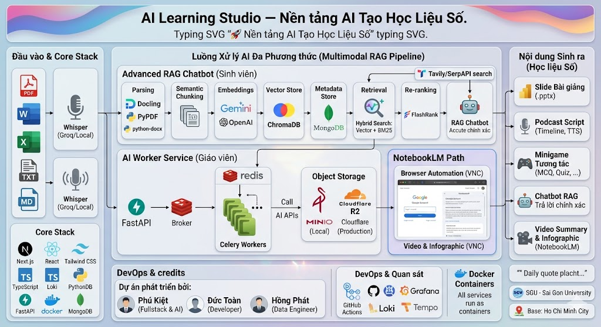
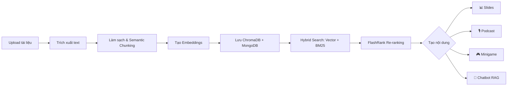
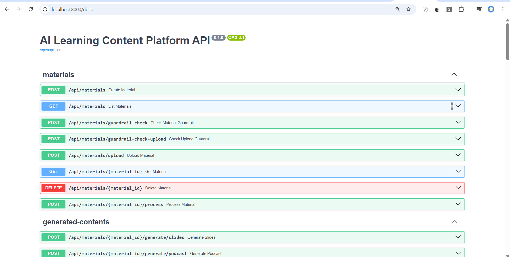
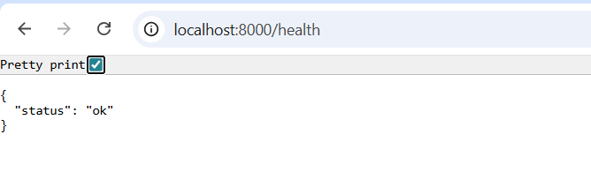
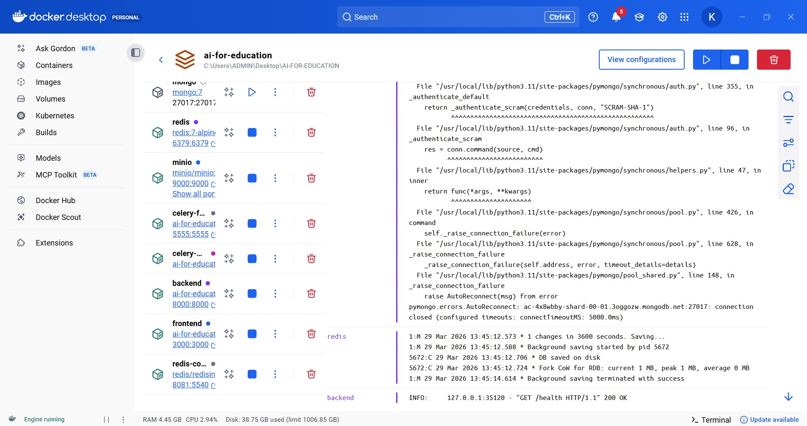
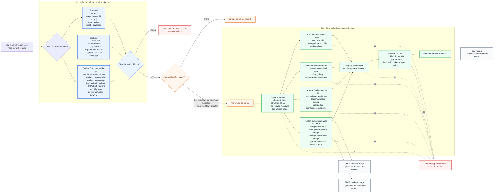

<div align="center">

  

  <a href="https://github.com/Kietnehi/AI-FOR-EDUCATION">
    
  </a>

  <br/><br/>

  <a href="https://github.com/Kietnehi/AI-FOR-EDUCATION/stargazers">
    
  </a>

  <a href="https://github.com/Kietnehi/AI-FOR-EDUCATION/network/members">
    
  </a>

  <a href="https://github.com/Kietnehi/AI-FOR-EDUCATION/issues">
    
  </a>

  <a href="https://github.com/Kietnehi/AI-FOR-EDUCATION/pulls">
    
  </a>

  <a href="https://github.com/Kietnehi/AI-FOR-EDUCATION/blob/main/LICENSE">
    
  </a>

  <a href="https://github.com/Kietnehi/AI-FOR-EDUCATION/actions/workflows/project-ci.yml">
    
  </a>

  <a href="https://github.com/Kietnehi/AI-FOR-EDUCATION/actions/workflows/project-cd.yml">
    
  </a>

  <br/><br/>

  <a href="https://skillicons.dev">
    
  </a>

  <br/><br/>

  &nbsp;&nbsp;&nbsp;
  

  <br/><br/>

</div>




# 🎓 AI Learning Studio — Nền tảng AI Tạo Học Liệu Số

**Nền tảng MVP production-ready giúp giáo viên và học sinh tạo nội dung học tập thông minh bằng AI. Chỉ cần tải tài liệu lên, hệ thống sẽ tự động tạo slide, podcast, minigame và chatbot hỏi đáp trong vài phút.**

Đây là hệ thống AI Agent đa phương thức (Multimodal RAG) toàn diện, được thiết kế theo kiến trúc vi dịch vụ (microservices) và triển khai hoàn toàn bằng **Docker**.

Dự án được chia thành 2 luồng xử lý chính:

  * **Chatbot for Student:** Trợ lý ảo hỗ trợ học tập trực tiếp. Hệ thống sử dụng **Advanced RAG Pipeline** (Semantic Chunking, Hybrid Search, Re-ranking) để trích xuất tri thức từ tài liệu (PDF, Word, Excel) và giải đáp thắc mắc của học sinh với độ chính xác cao nhất (citations đi kèm).
  * **AI Worker Service:** Trái tim của hệ thống, xử lý các tác vụ nền tảng phức tạp được điều phối bởi **FastAPI** và quản lý trạng thái qua **MongoDB**. Phân hệ này có khả năng xử lý đầu vào đa phương thức (Whisper STT, OCR), kết hợp tìm kiếm web (Tavily, SerpAPI) để tự động hóa việc tạo ra các học liệu trực quan: Slide bài giảng, Podcast, Minigame, và Video/Infographic.

**🛠 Công nghệ cốt lõi:** FastAPI, Next.js 14, MongoDB, ChromaDB (Vector Store), và hệ sinh thái mô hình AI tiên tiến (Gemini, OpenAI, Groq).


<p align="center">
  
  <br>
  <em>Hình 1: Full Pipeline Project (vẽ bằng Excalidraw)</em>
</p>

## Tính năng chính

- 📊 **Tạo slide bài giảng** `.pptx` tự động từ tài liệu học tập.
- 🎙️ **Tạo podcast script** với cấu trúc speaker/timeline và hỗ trợ TTS.
- 🎮 **Tạo minigame/quiz** tương tác (MCQ, điền từ, flashcard, ghép cặp).
- 🤖 **Chatbot RAG Nâng Cao**: Hỏi đáp theo học liệu với cơ chế **Hybrid Search** (Vector + BM25) và **FlashRank Re-ranking** giúp kết quả chính xác vượt trội.
- 🧩 **Semantic Chunking**: Chia nhỏ tài liệu thông minh theo ngữ nghĩa thay vì giới hạn từ (token), giữ trọn vẹn ngữ cảnh.
- 🏁 **Mục tiêu ngày (Daily Goals)**: Tự động theo dõi tiến trình học tập dựa trên lịch trình, hiển thị phần trăm hoàn thành theo thời gian thực.
- 🧭 **Web Search thông minh**: Mascot và Chatbot có thể tra cứu Web (Tavily/Google Search/SerpAPI) để bổ trợ kiến thức mới nhất.
- 🎥 **YouTube Interactive Lesson**: Tạo bài học từ video YouTube, dùng **SerpAPI** lấy transcript siêu tốc và tạo câu hỏi tương tác.
- 🎤 **Speech-to-Text đa dạng**: Hỗ trợ Whisper (Local) hoặc Groq Cloud (Tốc độ cao).
- 🔊 **Text-to-Speech**: Chuyển văn bản thành giọng nói tiếng Việt tự nhiên.
- 💻 **Premium AI Terminal**: Giao diện console mô phỏng macOS cực đẹp giúp người dùng theo dõi tiến trình xử lý AI.
- 📐 **3D Mascot Assistant**: Trợ lý ảo 3D tích hợp Three.js tương tác sinh động.

> **Lưu ý:** MongoDB sử dụng MongoDB Atlas qua `MONGO_URI`

 - **Search Website Online**: Trang tìm kiếm web tích hợp ngay trong AI Learning Studio, cho phép tra cứu theo từ khóa với các nhóm kết quả như website, tin tức, hình ảnh, video và sách để người dùng tổng hợp thông tin nhanh hơn.

---

## 1. Công nghệ sử dụng

### Frontend

| Công nghệ | Mô tả |
|-----------|-------|
| Next.js 14 | Framework frontend chính với App Router |
| React 18 | Xây dựng UI theo mô hình component |
| TypeScript | Kiểm soát kiểu dữ liệu ở frontend |
| Tailwind CSS v4 | Hệ thống utility CSS cho giao diện |
| Framer Motion | Animation và tương tác UI |
| Lucide React | Bộ icon chính của dự án |
| React Markdown + Remark GFM | Render nội dung Markdown trong UI |
| Three.js + React Three Fiber + Drei | Thành phần 3D và mascot tương tác |

### Backend & AI

| Công nghệ | Mô tả |
|-----------|-------|
| Python 3.11+ | Ngôn ngữ chính cho backend và AI pipeline |
| FastAPI | REST API framework |
| Pydantic / pydantic-settings | Validation schema và cấu hình ứng dụng |
| Motor / PyMongo | Kết nối và thao tác MongoDB |
| ChromaDB | Vector database lưu embeddings cục bộ |
| FlashRank | Re-ranker model giúp tối ưu độ chính xác của RAG |
| BM25 (Rank-BM25) | Thuật toán tìm kiếm từ khóa kết hợp với Vector Search |
| OpenAI API | Sinh nội dung, embeddings và fallback model |
| Google Gemini (`google-genai`) | LLM chính (hỗ trợ xoay vòng nhiều API Key) |
| Groq API | Speech-to-Text cloud tốc độ cao |
| SerpAPI | Lấy dữ liệu transcript và metadata YouTube siêu tốc |
| Docling / PyPDF / python-docx / pandas / openpyxl / Pillow | Trích xuất và xử lý tài liệu đa định dạng |
| python-pptx | Tạo slide PowerPoint tự động |
| Tavily Search / DuckDuckGo Search / Google Books API | Tìm kiếm web và sách |
| Playwright | Tự động hóa trình duyệt (luồng NotebookLM) |

### Dữ liệu, hàng đợi và lưu trữ

| Công nghệ | Mô tả |
|-----------|-------|
| MongoDB | Cơ sở dữ liệu nghiệp vụ chính |
| Redis | Broker và result backend cho Celery |
| Celery | Xử lý background jobs |
| Flower | Theo dõi Celery worker |
| MinIO | Object storage S3-compatible cho môi trường local |
| Cloudflare R2 | Object storage production cho file upload và file sinh ra |
| Boto3 | Tích hợp MinIO / Cloudflare R2 |

### DevOps, kiểm thử và phát hành

| Công nghệ | Mô tả |
|-----------|-------|
| Docker / Docker Compose | Môi trường chạy local, CI smoke test và đóng gói dịch vụ |
| GitHub Actions | CI/CD pipeline |
| GHCR | Publish container image frontend và backend |
| Vitest + Testing Library + jsdom | Unit test / integration test frontend |
| Pytest | Test backend |
| ESLint | Kiểm tra chất lượng mã frontend |

---

## 2. Kiến trúc tổng thể

### 2.1 Thành phần

- `frontend/` — Giao diện AI Learning Studio (dashboard, upload, materials, slides, podcast, minigame, chatbot)
- `backend/` — REST API, business logic, ingestion pipeline, RAG pipeline
- **Redis** — Message broker cho Celery tasks
- **Celery Worker** — Thực thi background tasks (generate slides, podcast, minigame)
- **Celery Flower** — Monitoring UI cho Celery tasks
- **MinIO / Cloudflare R2** — Object storage lưu trữ files (uploads, generated content)
- MongoDB — Lưu metadata tài liệu, chunks, nội dung tạo sinh, session chat, attempt game
- ChromaDB — Lưu vector embeddings để truy vấn ngữ nghĩa
- OpenAI — Dùng cho embedding và generation (nếu có API key)
- Whisper/Groq — Dùng cho Speech-to-Text khi người dùng ghi âm trong chatbot

### 2.2 Luồng xử lý chính



1. Người dùng nhập hoặc tải file học liệu (PDF/DOCX/TXT/MD).
2. Backend đọc và trích xuất text.
3. Làm sạch nội dung.
4. Chia nhỏ (chunking).
5. Tạo embeddings cho từng chunk.
6. Lưu vector vào ChromaDB.
7. Lưu metadata/chunk vào MongoDB.
8. Dùng retrieval theo query.
9. Dùng context truy xuất để tạo slide, podcast script, minigame, trả lời chatbot có citations.

---

## 3. Cấu trúc thư mục

```text
AI-FOR-EDUCATION/
├─ backend/                     ← Mã nguồn Server (FastAPI + AI Pipeline)
│  ├─ app/                      ← Logic ứng dụng chính
│  │  ├─ ai/                    ← Các module xử lý AI (RAG, Chatbot, Embeddings,...)
│  │  │  ├─ chatbot/            ← Điều phối chatbot và logic hội thoại
│  │  │  ├─ chunking/           ← Chia nhỏ tài liệu (Semantic vs Text Chunker)
│  │  │  ├─ embeddings/         ← Chuyển đổi văn bản thành vector
│  │  │  ├─ generation/         ← Tạo nội dung (Slides, Podcast, Minigame,...)
│  │  │  ├─ ingestion/          ← Làm sạch và nạp dữ liệu đầu vào
│  │  │  ├─ parsing/            ← Trích xuất text từ các định dạng file (PDF, Word,...)
│  │  │  ├─ retrieval/          ← Truy xuất (Hybrid Search + FlashRank Reranker)
│  │  │  └─ vector_store/       ← Quản lý lưu trữ vector (ChromaDB)
│  │  ├─ api/                   ← Định nghĩa các Endpoints REST API
│  │  ├─ core/                  ← Cấu hình hệ thống, biến môi trường, logging
│  │  ├─ db/                    ← Kết nối Database (MongoDB, ChromaDB)
│  │  ├─ models/                ← Định nghĩa Schema Database (Pydantic/Mongo)
│  │  ├─ repositories/          ← Lớp tương tác trực tiếp với Database
│  │  ├─ schemas/               ← Data Transfer Objects (DTO) cho API request/response
│  │  ├─ services/              ← Business logic xử lý yêu cầu nghiệp vụ
│  │  │  ├─ storage.py          ← MinIO/Cloudflare R2 storage service
│  │  │  ├─ material_service.py ← Quản lý học liệu
│  │  │  ├─ generation_service.py← Tạo nội dung tự động
│  │  │  ├─ chat_service.py     ← Trợ lý chatbot RAG
│  │  │  ├─ youtube_lesson_service.py ← Xử lý bài học YouTube (SerpAPI)
│  │  │  └─ ...
│  │  ├─ tasks.py               ← Celery background tasks (Slides, Email, Reminders)
│  │  └─ main.py                ← File chạy chính của FastAPI
├─ frontend/                    ← Mã nguồn Giao diện (Next.js + TailwindCSS)
│  ├─ app/                      ← Các trang và Layout (Next.js App Router)
│  │  ├─ chatbot/               ← Trợ lý học tập trực tiếp
│  │  ├─ schedule/              ← Quản lý lịch trình & Daily Goals
│  │  ├─ materials/             ← Quản lý học liệu số
│  │  └─ ...
│  ├─ components/               ← Thành phần UI dùng chung
│  │  ├─ 3d/                    ← Mascot 3D (Three.js)
│  │  ├─ layout/                ← Sidebar, AppShell, Navigation
│  │  ├─ ui/                    ← MacTerminal, Glassy Buttons, Cards
│  │  └─ ...
│  ├─ lib/                      ← API Client (apiFetch), State, Utilities
│  ├─ public/                   ← Tài nguyên tĩnh (3D Models, Icons, Logos)
│  ├─ types/                    ← Định nghĩa kiểu dữ liệu TypeScript
│  ├─ Dockerfile                ← Docker cấu hình cho frontend
│  ├─ package.json              ← Quản lý thư viện Node.js
│  └─ .env.example              ← Mẫu file biến môi trường frontend
├─ Document_PRD/                ← Tài liệu đặc tả yêu cầu và thiết kế dự án
├─ image/                       ← Ảnh minh họa cho README và hệ thống
├─ markdown_docs/               ← Các tài liệu hướng dẫn chi tiết (.md)
│  ├─ REDIS_CELERY_MINIO.md     ← Redis, Celery, MinIO integration guide
│  ├─ CI_SUMMARY_2026-03-28.md  ← CI/CD pipeline summary
│  ├─ DOCKER_REVIEW_2026-03-27.md← Docker setup review
│  ├─ LLM_API_FLOW.md           ← LLM API integration flow
│  ├─ REASONING_STREAMING.md    ← Reasoning & streaming flow guide
│  ├─ MINIGAME.md               ← Minigame documentation
│  ├─ NOTEBOOKLM_VIDEO_INFOGRAPHIC_REVIEW_2026-03-26.md
│  ├─ TOM_TAT_CD_2026-03-28.md  ← CD pipeline summary
│  └─ WEB_SEARCH_GUIDE_VI.md    ← Web search feature guide
├─ TESTING_CODE/                ← Code test mẫu và tài liệu API bên thứ 3
├─ docker-compose.yml           ← Cấu hình triển khai toàn bộ hệ thống bằng Docker
├─ README.md                    ← Hướng dẫn dự án chính
└─ .env.example                 ← Mẫu file môi trường tổng cho Docker
```

---

## 4. API chính (MVP)

> **API Documentation:** [http://localhost:8000/docs](http://localhost:8000/docs) (Swagger UI)

<p align="center">
<table style="margin: 0 auto;">
  <tr>
    <td align="center" style="padding:8px;">
      
      <div style="margin-top:8px; font-weight:600;">Swagger UI — <a href="http://localhost:8000/docs">/docs</a></div>
    </td>
    <td align="center" style="padding:8px;">
      
      <div style="margin-top:8px; font-weight:600;">Health Check — <a href="http://localhost:8000/health">/health</a></div>
    </td>
  </tr>
</table>
</p>

### 4.1 Materials
- `POST /api/materials` — Tạo học liệu từ text
- `POST /api/materials/upload` — Tạo học liệu từ file upload
- `GET /api/materials` — Danh sách học liệu (có pagination)
- `GET /api/materials/{material_id}` — Chi tiết học liệu
- `POST /api/materials/{material_id}/process` — Xử lý tài liệu (extract, chunk, embedding)
- `DELETE /api/materials/{material_id}` — Xóa học liệu
- `POST /api/materials/guardrail-check` — Kiểm tra nội dung học liệu (guardrail)
- `POST /api/materials/guardrail-check-upload` — Kiểm tra nội dung từ file upload

### 4.2 Generation
- `POST /api/materials/{material_id}/generate/slides` — Tạo slides `.pptx`
- `POST /api/materials/{material_id}/generate/podcast` — Tạo podcast script
- `POST /api/materials/{material_id}/generate/minigame` — Tạo minigame/quiz
- `GET /api/generated-contents/{content_id}` — Lấy nội dung đã tạo
- `POST /api/notebooklm/generate-media` — Tạo video + infographic với NotebookLM (2 bước: confirm → download)

### 4.3 Files
- `GET /api/files/{file_path}/download` — Download file (hỗ trợ đường dẫn tuyệt đối)
- `GET /api/files/notebooklm/temp/{session_id}/{file_type}/{file_name}/preview` — Xem trước file tạm từ NotebookLM (video/infographic)

### 4.4 Chat
- `POST /api/chat/{material_id}/session` — Tạo session chat mới
- `GET /api/chat/sessions/{session_id}` — Lấy session + tin nhắn
- `POST /api/chat/sessions/{session_id}/message` — Gửi tin nhắn (có hỗ trợ ảnh)
- `POST /api/chat/sessions/{session_id}/web-search` — Web search cho chatbot theo tài liệu
- `POST /api/chat/mascot/message` — Chat với mascot (không dùng RAG)
- `POST /api/chat/transcribe` — Chuyển audio thành text (hỗ trợ `local-base`, `whisper-large-v3`, `whisper-large-v3-turbo`)
- `POST /api/chat/tts` — Chuyển text thành audio (Text-to-Speech)

### 4.5 Games
- `POST /api/games/{generated_content_id}/submit` — Nộp bài làm minigame
- `GET /api/games/attempts/{attempt_id}` — Xem kết quả bài làm

### 4.6 YouTube Interactive Lesson
- `POST /api/youtube-lessons` — Tạo bài học tương tác từ video YouTube
- `GET /api/youtube-lessons/{lesson_id}` — Lấy chi tiết bài học YouTube
- `POST /api/youtube-lessons/{lesson_id}/translate-transcript` — Dịch transcript sang ngôn ngữ khác
- `GET /api/youtube-lessons/history` — Lịch sử bài học YouTube

---


## 🚀 Chạy toàn bộ hệ thống bằng Docker Compose (Khuyên dùng)



*Giao diện Docker Desktop hiển thị đầy đủ các thành phần đang chạy: Frontend, Backend, Database (MongoDB, Redis), Storage (Minio), Redis Commander và các Celery Workers/Flower phục vụ tác vụ nền.*

> 💡 **Ghi chú về Storage:** Hệ thống hỗ trợ **MinIO (local)** và **Cloudflare R2 (production)**. Khi bật `USE_OBJECT_STORAGE=true` và `USE_R2=true`, file upload và file generate sẽ ưu tiên lưu trên R2; nếu R2 không khả dụng, hệ thống sẽ fallback local.

Dự án đã được tối ưu hóa cho môi trường Docker trên Windows/macOS/Linux với tính năng **Hot-reload** hoàn chỉnh (sửa code cập nhật ngay lập tức mà không cần restart container).

### ⚙️ Hướng dẫn các bước:

#### 1. Chuẩn bị file môi trường
Tạo file `.env` ở thư mục gốc của dự án:
```bash
cp .env.docker.example .env
```
Mở file `.env` và điền ít nhất `MONGO_URI` (Khuyến nghị dùng MongoDB Atlas) và các API Key cần thiết (`OPENAI_API_KEY`, `GEMINI_API_KEY`, `GROQ_API_KEY`).

#### 2. Khởi động hệ thống
```bash
# Chạy với MongoDB Atlas (mặc định - nhẹ nhất)
docker compose build
docker compose up

# HOẶC Chạy với MongoDB Local (nếu không có Atlas)
docker compose --profile local-db build
docker compose --profile local-db up
```
*Lưu ý: Chạy lại `docker compose build` khi có thay đổi cấu hình `Dockerfile` hoặc dependencies.*

#### 3. Truy cập hệ thống
*   🌐 **Frontend:** [http://localhost:3000](http://localhost:3000)
*   🔧 **Backend API:** [http://localhost:8000](http://localhost:8000)
*   📄 **Swagger Docs:** [http://localhost:8000/docs](http://localhost:8000/docs)
*   🖥️ **Theo dõi Chrome của NotebookLM trong Docker:** [http://localhost:6080/vnc.html](http://localhost:6080/vnc.html)

#### Bảng Port và Đường dẫn truy cập nhanh

| Dịch vụ | Host Port | Container Port | Đường dẫn truy cập |
|---------|-----------|----------------|--------------------|
| Frontend | `3000` | `3000` | [http://localhost:3000](http://localhost:3000) |
| Backend API | `8000` | `8000` | [http://localhost:8000](http://localhost:8000) |
| Swagger Docs | `8000` | `8000` | [http://localhost:8000/docs](http://localhost:8000/docs) |
| Health Check | `8000` | `8000` | [http://localhost:8000/health](http://localhost:8000/health) |
| noVNC (NotebookLM Browser) | `6080` | `6080` | [http://localhost:6080/vnc.html](http://localhost:6080/vnc.html) |
| VNC (NotebookLM Browser - native client) | `5900` | `5900` | Dùng VNC client (không phải HTTP) |
| Flower (Celery Monitor) | `5555` | `5555` | [http://localhost:5555](http://localhost:5555) |
| MinIO API | `9000` | `9000` | [http://localhost:9000](http://localhost:9000) |
| MinIO Console | `9001` | `9001` | [http://localhost:9001](http://localhost:9001) |
| Redis | `6379` | `6379` | Dùng Redis client/CLI |
| Redis Insight (service `redis-commander`) | `8081` | `5540` | [http://localhost:8081](http://localhost:8081) |
| MongoDB (profile `local-db`) | `27017` | `27017` | Dùng MongoDB client/Compass |
| Grafana (monitoring stack - optional) | `3300` | `3000` | [http://localhost:3300](http://localhost:3300) |
| Prometheus (monitoring stack - optional) | `9090` | `9090` | [http://localhost:9090](http://localhost:9090) |
| Cloudflare R2 (production object storage) | `N/A` | `N/A` | Dịch vụ cloud, không map localhost port |

#### Theo dõi trình duyệt NotebookLM khi chạy Docker

Luồng NotebookLM trong Docker không mở cửa sổ Chrome native trên máy host. Thay vào đó, backend chạy Chrome trong một display ảo bên trong container và xuất màn hình qua noVNC để bạn theo dõi trong trình duyệt.

- Mở `http://localhost:6080/vnc.html`, bấm `Connect`, rồi kích hoạt workflow NotebookLM để quan sát Chrome trong container.
- Nếu màn hình bị đen, hãy reload tab noVNC hoặc chạy `docker compose restart backend`.
- Tài liệu chi tiết: [markdown_docs/NOTEBOOKLM_DOCKER_BROWSER_MONITORING.md](markdown_docs/NOTEBOOKLM_DOCKER_BROWSER_MONITORING.md)

#### 4. Dừng hệ thống
```bash
docker compose down
```

### 💡 Lưu ý về Hot-Reload:
- **Hot-reload trên Windows:** Hệ thống sử dụng cơ chế **Polling** (`CHOKIDAR_USEPOLLING=true`) để đảm bảo nhận diện thay đổi file ngay lập tức từ ổ đĩa NTFS của Windows vào Linux container.
- **Vị trí lưu trữ:** Để đạt hiệu năng tốt nhất trên Windows, bạn nên để code bên trong hệ thống file của **WSL2** (`\\wsl$\...`).


---

## 5. Hướng dẫn chạy local chi tiết

### 5.1 Yêu cầu trước khi chạy

- Windows 10/11 hoặc Linux/macOS
- Tài khoản MongoDB Atlas (cluster đã tạo sẵn)
- Python 3.11+
- Node.js 20+ và npm
- FFmpeg (bắt buộc cho local Whisper)

Kiểm tra nhanh:

```powershell
py --version
node -v
npm -v
```

### 5.2 Bước 1: Chuẩn bị MongoDB Atlas

Tạo và cấu hình trên Atlas:

1. Tạo cluster (M0/M2/M5 đều được cho MVP).
2. Tạo Database User (username/password).
3. Vào Network Access và thêm IP hiện tại (hoặc `0.0.0.0/0` cho môi trường dev, không khuyến nghị cho production).
4. Lấy connection string dạng SRV.vvvv

Ví dụ:

```text
mongodb+srv://<username>:<password>@<cluster-url>/?retryWrites=true&w=majority&appName=<app-name>......
```

### 5.3 Bước 2: Cấu hình biến môi trường

#### Backend

```powershell
cd backend
copy .env.example .env
```

Mở file `.env` và cập nhật tối thiểu:
- `MONGO_URI=mongodb+srv://<username>:<password>@<cluster-url>/?retryWrites=true&w=majority&appName=<app-name>`
- `MONGO_DB_NAME=ai_learning_platform`
- `OPENAI_API_KEY=` (có thể để trống nếu chỉ dùng Gemini, nhưng cần để fallback)

**Lưu ý về Gemini API keys:**
- **Nếu muốn dùng nhiều Gemini keys** (để tránh rate limit): điền `GEMINI_API_KEYS` với các keys phân cách bằng dấu phẩy (ví dụ: `key1,key2,key3`). Hệ thống sẽ thử lần lượt từng key.
- **Nếu chỉ có 1 Gemini key**: điền `GEMINI_API_KEY` là đủ. Có thể để `GEMINI_API_KEYS` trống.
- **Ưu tiên**: `GEMINI_API_KEYS` sẽ được dùng trước. Nếu `GEMINI_API_KEYS` rỗng, hệ thống dùng `GEMINI_API_KEY`.
- **Không cần điền cả hai**. Chọn một trong hai để tránh nhầm lẫn.
- **Fallback**: Khi tất cả Gemini keys đều thất bại, hệ thống sẽ tự động dùng OpenAI (nếu `OPENAI_API_KEY` có sẵn).
- **Backup**: Bạn nên có ít nhất 2 Gemini keys để đảm bảo tính sẵn sàng cao.

Biến môi trường cho Speech-to-Text:
- `WHISPER_MODEL=base`
- `WHISPER_LANGUAGE=` (để trống để auto detect)
- `GROQ_API_KEY=` (điền khi dùng Groq model)
- `GROQ_BASE_URL=https://api.groq.com`

Lưu ý:
- Nếu bỏ trống `OPENAI_API_KEY`, hệ thống vẫn chạy bằng fallback để demo luồng.
- Muốn kết quả AI thật, cần điền `OPENAI_API_KEY` hợp lệ.
- **Hệ thống hỗ trợ nhiều Gemini API keys qua `GEMINI_API_KEYS` (comma-separated)**. Keys sẽ được dùng xoay vòng. Nếu `GEMINI_API_KEYS` không có, hệ thống dùng `GEMINI_API_KEY` đơn (backward compatibility). Khi tất cả Gemini keys fail, sẽ fallback sang OpenAI (nếu có).
- Nếu password MongoDB có ký tự đặc biệt (ví dụ `@`, `#`, `%`), cần URL-encode trong `MONGO_URI`.
- Nếu dùng model Groq cho Speech-to-Text, bắt buộc điền `GROQ_API_KEY`.

#### Frontend

```powershell
cd ..\frontend
copy .env.example .env.local
```

Mặc định đã đúng local:
- `NEXT_PUBLIC_API_BASE_URL=http://localhost:8000/api`
- `NEXT_PUBLIC_API_HOST=http://localhost:8000`

### 5.4 Bước 3: Cài dependencies và chạy backend

**Cách 1 (khuyên dùng - đơn giản):**
```powershell
cd ..\backend
pip install -r requirements.txt
python run.py
```

**Cách 2 (lệnh đầy đủ):**
```powershell
cd ..\backend
pip install -r requirements.txt
python -m uvicorn app.main:app --reload --port 8000
```

Cài FFmpeg (Windows) nếu chưa có:

```powershell
choco install ffmpeg
```

Khi backend chạy thành công:
- API: `http://localhost:8000`
- Swagger: `http://localhost:8000/docs`
- Health check: `http://localhost:8000/health`

<p align="center">
<table style="margin: 0 auto;">
  <tr>
    <td align="center" style="padding:8px;">
      
      <div style="margin-top:8px; font-weight:600;">Giao diện Swagger UI - /docs</div>
    </td>
    <td align="center" style="padding:8px;">
      
      <div style="margin-top:8px; font-weight:600;">Trạng thái hệ thống - /health</div>
    </td>
  </tr>
</table>
</p>

Kiểm tra backend bằng PowerShell:

```powershell
Invoke-RestMethod -Uri "http://localhost:8000/health" -Method Get
```

### 5.5 Bước 4: Cài dependencies và chạy frontend

Mở terminal mới:

```powershell
cd d:\DACN\frontend
npm install
npm run dev
```

Frontend chạy tại: `http://localhost:3000`

### 5.6 Tóm tắt chạy nhanh (copy-paste)

Terminal 1 (backend) - **Cách 1 (đơn giản):**

```powershell
cd d:\DACN\backend
copy .env.example .env
pip install -r requirements.txt
python run.py
```

Hoặc **Cách 2 (lệnh đầy đủ):**

```powershell
cd d:\DACN\backend
copy .env.example .env
pip install -r requirements.txt
uvicorn app.main:app --reload --port 8000
```

Terminal 2 (frontend):

```powershell
cd d:\DACN\frontend
copy .env.example .env.local
npm install
npm run dev
```

---

## 6. CI / CD

Hiện tại dự án có **CI đầy đủ**, và **CD bán thực tế**: đã build artifact, publish Docker image lên GHCR, nhưng **chưa deploy lên server thật**. Bước triển khai hiện vẫn là `deploy-placeholder` để tổng hợp metadata và báo cáo phát hành..

- Workflow CI: `.github/workflows/project-ci.yml`
- Workflow CD: `.github/workflows/project-cd.yml`
- CI trigger: `push` và `pull_request` khi thay đổi ở `frontend/`, `backend/`, `docker-compose.yml`, `docker-compose.ci.yml`, `.env.docker.example`, `project-ci.yml`, `project-cd.yml`
- CD trigger: `workflow_dispatch`, hoặc `workflow_run` sau khi `CI Dự Án` thành công trên `main` hoặc `kiet`
- Flow hiện tại:
  `CI` pass -> `CD Dự Án` tạo metadata -> build frontend artifact -> package backend artifact -> resolve Docker bundle -> publish image frontend/backend lên GHCR -> tạo `deploy-placeholder` -> gộp `full-release-bundle`
- Frontend CI: `npm ci` -> `npm run lint` -> `npx vitest run --coverage --reporter=json`
- Backend CI: `pip install -r requirements-test.txt` -> `pytest --junitxml=junit.xml`
- Docker CI: `docker compose -f docker-compose.ci.yml build` -> `docker compose -f docker-compose.ci.yml up`, chờ `/health` của backend và HTTP response của frontend, rồi `down -v`
- Khi CI fail trên sự kiện `push`, workflow sẽ tự tạo hoặc cập nhật GitHub Issue
- Nếu CD fail, workflow CD cũng sẽ tự tạo hoặc cập nhật GitHub Issue
- GHCR login hiện dùng secret cố định `GHCR_TOKEN`
- Docker images được publish lên:
  - `ghcr.io/kietnehi/ai-for-education-backend`
  - `ghcr.io/kietnehi/ai-for-education-frontend`
- Tag image hiện có thể bao gồm:
  - `latest` cho default branch
  - `<sha7>`
  - `<branch>`
- Artifact CD quan trọng nhất: `full-release-bundle-<sha>` trong tab Actions Artifacts của workflow `CD Dự Án`
- Các artifact trung gian:
  `cd-release-metadata`, `frontend-release-bundle-<sha>`, `backend-release-bundle-<sha>`, `docker-release-bundle-<sha>`, `ghcr-images-<sha>`, `deployment-summary-<sha>`
- Tài liệu chi tiết:
  - `markdown_docs/CI_SUMMARY_2026-03-28.md`
  - `markdown_docs/TOM_TAT_CD_2026-03-28.md`

### 6.1 Sơ đồ CI/CD tổng thể



### 6.2 Các job chính và thời gian ước tính

| Job | Thời gian (lần đầu) | Thời gian (có cache) | Mô tả |
|-----|---------------------|----------------------|-------|
| **Frontend** | 2-3 phút | 1-2 phút | Install deps + lint + test + coverage |
| **Backend** | 1-2 phút | 30-60 giây | Install deps + pytest + coverage |
| **Docker Compose Smoke** | 3-5 phút | 1-2 phút | Build images + health check |
| **CD Prepare Release** | 30 giây | 30 giây | Generate metadata + release notes |
| **CD Build Frontend** | 2-3 phút | 1-2 phút | npm build + bundle |
| **CD Package Backend** | 30 giây | 30 giây | Syntax check + bundle |
| **CD Package Docker** | 30 giây | 30 giây | Compose config + bundle |
| **CD Publish GHCR Images** | 2-5 phút | 1-3 phút | Build và push image frontend/backend |
| **CD Deploy Placeholder** | 30 giây | 30 giây | Tạo deployment summary placeholder |
| **CD Release Bundle** | 1 phút | 1 phút | Download + merge all release artifacts |

> 💡 **Lưu ý:** Thời gian có thể thay đổi tùy thuộc vào kích thước code changes và tình trạng cache của GitHub Actions.

### 6.4 Cách chạy CI local

```bash
cd frontend
npm ci
npm run test:ci

cd ../backend
python -m pip install -r requirements-test.txt
python -m pytest

cp .env.docker.example .env
docker compose build
docker compose up
curl http://localhost:8000/health
docker compose down -v
```

Coverage report sau khi chạy:

- Frontend: `frontend/coverage/index.html`
- Backend: `backend/htmlcov/index.html`
- Docker: kiểm tra `http://localhost:8000/health` và `docker compose ps`

### 6.5 Ghi chú

- Frontend có coverage threshold trong `frontend/vitest.config.ts`
- Backend có coverage threshold trong `backend/pytest.ini`
- Tài liệu chi tiết hơn:
  - `markdown_docs/CI_SUMMARY_2026-03-28.md`
  - `markdown_docs/TOM_TAT_CD_2026-03-28.md`

### 6.6 Hướng dẫn tải full-release-bundle từ CD

1. Vào tab **Actions** trên GitHub
2. Chọn workflow **CD Dự Án**
3. Click vào lần chạy gần nhất (có status ✅ thành công)
4. Kéo xuống phần **Artifacts** ở cuối trang
5. Click vào `full-release-bundle-<sha>` để tải release bundle hoặc `ghcr-images-<sha>` để xem danh sách image đã publish

> 💡 **Lưu ý:** Artifact chỉ được lưu trong **90 ngày**. Tải về ngay sau khi CD chạy thành công.

---

## 6.5 Redis, Celery & Object Storage

### 🔴 Redis - Message Broker & Result Backend
- **Port:** `6379`
- **Monitoring:** http://localhost:8081 (Redis Insight)
- **Vai trò:** Message broker cho Celery tasks + lưu kết quả

### 🍀 Celery - Distributed Task Queue
- **Services:** Celery Worker (execute tasks) + Flower (monitoring)
- **Port:** `5555` (Flower UI)
- **Tasks:** Generate slides, podcast, minigame
- **Monitoring:** http://localhost:5555

### 📦 MinIO / Cloudflare R2 - Object Storage
- **Ports:** `9000` (API), `9001` (Console)
- **Console:** http://localhost:9001 (minioadmin/minioadmin123)
- **Bucket local (MinIO):** `ai-learning-storage`
- **Bucket production (R2):** cấu hình qua `R2_BUCKET`
- **Storage:** uploads/, generated/slides/, generated/podcasts/

### Quick Commands
```bash
# Redis - Check task results
docker exec any2-redis redis-cli -n 1 KEYS "celery-task-meta-*"

# MinIO - List files local
docker exec any2-minio mc ls myminio/ai-learning-storage/

# Celery Worker logs
docker logs any2-celery-worker --tail=50
```

### Integration Flow
```
Upload → MinIO/Cloudflare R2 → MongoDB → Queue (Redis) → Celery Worker → Generate → MinIO/Cloudflare R2 → Result (Redis)
```

📚 **Chi tiết:** Xem `markdown_docs/Redis_Celery_Minio.md`

---

## 6.7 Monitoring (Prometheus + Grafana)

Hệ thống đã tích hợp endpoint metrics cho backend FastAPI và có thể scrape bằng Prometheus để visualize trên Grafana.

### Endpoint metrics
- Backend expose metrics tại: `GET /metrics`
- URL local: http://localhost:8000/metrics

### Chạy stack monitoring
1. `cd Monitoring/railway-grafana-stack`
2. `docker compose up`

Các dịch vụ chính:
- Grafana: http://localhost:3300
- Prometheus: http://localhost:9090
- Loki: http://localhost:3100
- Tempo: http://localhost:3200

### Cấu hình scrape backend
- File Prometheus: `Monitoring/railway-grafana-stack/prometheus/prom.yml`
- Job backend hiện tại: `ai-learning-backend`
- Target local: `host.docker.internal:8000`

### Kiểm tra nhanh
1. Mở http://localhost:9090/targets
2. Đảm bảo target `ai-learning-backend` ở trạng thái `UP`
3. Mở Grafana và query datasource Prometheus với `up`

### Query gợi ý cho Grafana
- `rate(http_requests_total[5m])`
- `sum(rate(http_requests_total[5m])) by (handler, method, status)`
- `histogram_quantile(0.95, sum(rate(http_request_duration_seconds_bucket[5m])) by (le, handler))`

---

## 7. Troubleshooting

### Lỗi không có lệnh `python`
Trên Windows, dùng `py` thay cho `python`.

### Lỗi kết nối MongoDB Atlas
- Kiểm tra lại username/password trong connection string SRV.
- Kiểm tra Network Access trên Atlas đã allow IP hiện tại chưa.
- Kiểm tra biến `MONGO_URI` trong `backend/.env` đã đúng format chưa.

### Lỗi frontend không gọi được backend
- Kiểm tra backend có đang chạy cổng `8000`.
- Kiểm tra `frontend/.env.local` có đúng `NEXT_PUBLIC_API_BASE_URL`.

### Không có OpenAI API key
- Hệ thống vẫn chạy demo với fallback.
- Muốn kết quả AI thật, cần điền `OPENAI_API_KEY` hợp lệ.

### Lỗi Speech-to-Text Groq trả 500
- Kiểm tra đã cài package `groq`: `pip install groq`.
- Kiểm tra `GROQ_API_KEY` trong `backend/.env`.
- Đảm bảo `GROQ_BASE_URL=https://api.groq.com`.
- Nếu đổi model STT sang `local-base`, kiểm tra FFmpeg có sẵn bằng lệnh `ffmpeg -version`.

### Lỗi 404 với đường dẫn `/openai/v1/openai/v1/audio/transcriptions`
- Nguyên nhân: base URL Groq bị lặp path.
- Cách đúng: dùng `GROQ_BASE_URL=https://api.groq.com`.

### Lỗi CSS/TailwindCSS
- Đảm bảo đã cài đầy đủ: `npm install tailwindcss @tailwindcss/postcss postcss`
- File `postcss.config.mjs` phải tồn tại trong `frontend/`.

---

## Phụ lục: Chức năng tạo Video + Infographic với NotebookLM

Chức năng này dùng NotebookLM để tạo **video tóm tắt** và **infographic** từ học liệu đã có trong hệ thống.

Luồng hiện tại gồm 3 bước:

1. Nhấn **Tạo Video + Infographic** để upload học liệu lên NotebookLM.
2. Nhấn **Xác nhận và bắt đầu tạo Video + Infographic** để hệ thống bấm tạo media.
3. Khi NotebookLM render xong, nhấn **Tải xuống** để backend kéo file về lưu trữ.

Trải nghiệm hiện tại:

- Thông báo hiển thị ở phía trên, tự ẩn sau `6 giây` và hỗ trợ cả chế độ sáng lẫn tối.
- Infographic có thể bấm xem trực tiếp ngay trên web, không mở tab mới.
- Nếu NotebookLM chưa render xong, backend sẽ trả lỗi rõ ràng thay vì báo thành công giả.

API chính:

- `POST /api/materials/{id}/generate/notebooklm-media`
- `POST /api/notebooklm/sessions/{session_id}/confirm-artifacts`
- `POST /api/notebooklm/sessions/{session_id}/confirm`
- `POST /api/notebooklm/sessions/{session_id}/cancel`

Lưu ý vận hành:

- Tài khoản Google dùng cho NotebookLM phải đăng nhập sẵn trong Chrome profile của backend.
- Cần cấu hình đúng `NOTEBOOKLM_DOCUMENTS_DIR`, `NOTEBOOKLM_USER_DATA_DIR`, `NOTEBOOKLM_GENERATE_WAIT_SECONDS`, `NOTEBOOKLM_HEADLESS`.
- Chức năng này hiện phù hợp hơn cho môi trường demo hoặc nội bộ; nếu chạy nhiều người dùng đồng thời thì cần hoàn thiện thêm phần session và concurrency.

---

## Minigame

- Tạo minigame tự động từ học liệu (MCQ, điền từ, ghép cặp).
- API: `POST /api/materials/{material_id}/generate/minigame` — tạo minigame.
- Chơi & nộp: `POST /api/games/{generated_content_id}/submit` — nộp kết quả.
- Frontend: trang minigame tại `frontend/app/materials/[id]/minigame`.

---

## 8. Tài liệu bổ sung & API Keys

### 🔑 Quản lý API Keys
- **Google Gemini API:** [Google AI Studio (Lấy API Key tại đây)](https://aistudio.google.com/api-keys)
- **OpenAI API:** [OpenAI Platform](https://openai.com/api/)
- **OpenRouter API:** [OpenRouter Dashboard (Cho các model gpt-4o-mini, gpt-4o, claude-3...)](https://openrouter.ai/)
- **Groq API:** [Groq Cloud (Cho Whisper STT nhanh nhất)](https://console.groq.com/keys)

### 📚 Tài liệu tham khảo
- **Redis, Celery & Object Storage:** [Hướng dẫn tích hợp hạ tầng](markdown_docs/Redis_Celery_Minio.md)
- **Monitoring & Cloudflare R2:** [Hướng dẫn cấu hình Monitoring và R2](markdown_docs/MONITORING_AND_CLOUDFLARE_R2.md)
- **Docker:** [Trang chủ Docker](https://www.docker.com/)
- **Redis:** [Redis Documentation](https://redis.io/)
- **RedisInsight:** [RedisInsight GUI](https://github.com/redis/RedisInsight)
- **MinIO:** [High Performance Object Storage](https://www.min.io/)
- **Cloudflare R2:** [Cloudflare R2 Documentation](https://developers.cloudflare.com/r2/)
- **Celery:** [Distributed Task Queue](https://docs.celeryq.dev/en/stable/)
- **Gemini API:** [Gemini API Quickstart](https://ai.google.dev/gemini-api/docs/quickstart)
- **Web Search:** [Hướng dẫn Web Search (VI)](markdown_docs/WEB_SEARCH_GUIDE_VI.md)
- **LLM API Flow:** [Luồng xử lý AI & LLM](markdown_docs/LLM_API_FLOW.md)
- **Reasoning & Streaming:** [Luồng reasoning và streaming trong chatbot](markdown_docs/REASONING_STREAMING.md)
- **Minigame Design:** [Thiết kế & logic Minigame](markdown_docs/MINIGAME.md)
- **NotebookLM Media:** [NotebookLM Video & Infographic](markdown_docs/NOTEBOOKLM_VIDEO_INFOGRAPHIC_REVIEW_2026-03-26.md)
- **Docker Review bản hiện tại:** [Đánh giá Docker & Hot-reload](markdown_docs/DOCKER_REVIEW.md)
- **CI Summary bản hiện tại:** [Tóm tắt Pipeline CI dự án](markdown_docs/CI_SUMMARY.md)
- **CD Summary:** [Tóm tắt CI/CD và phát hành](markdown_docs/TOM_TAT_CD.md)
- **NotebookLM Docker Browser:** [Theo dõi Chrome của NotebookLM trong Docker](markdown_docs/NOTEBOOKLM_DOCKER_BROWSER_MONITORING.md)
- **Storage & Media Fixes:** [Ghi chú các bản vá storage và media](markdown_docs/STORAGE_AND_MEDIA_FIXES.md)
- **Web Search Online Review:** [Đánh giá và tổng hợp Web Search online](markdown_docs/WEB_SEARCH_ONLINE_REVIEW.md)
- **YouTube Interactive Lesson:** [Hướng dẫn chức năng YouTube tương tác](markdown_docs/YOUTUBE_INTERACTIVE_LESSON_GUIDE_VI.md)

---

## 🔗 Các tác giả & Tài khoản Github

<p align="center">
  
</p>

| | | | |
| :---: | :---: | :---: | :---: |
| <a href="https://github.com/Kietnehi"></a> | <a href="https://github.com/ductoanoxo"></a> | <a href="https://github.com/phatle224"></a> | <a href="https://github.com/nhdotvn"></a> |
|  |  |  |  |
| <b><a href="https://github.com/Kietnehi">Trương Phú Kiệt</a></b> | <b><a href="https://github.com/ductoanoxo">Đức Toàn</a></b> | <b><a href="https://github.com/phatle224">Phát Lê</a></b> | <b><a href="https://github.com/nhdotvn">Lê Ngọc Hiệp</a></b> |
| Fullstack Dev & AI Researcher | Developer | Data Engineer | Supporter |
| <p align="center">  <a href="https://github.com/Kietnehi"></a></p> | <p align="center">  <a href="https://github.com/ductoanoxo"></a></p> | <p align="center">  <a href="https://github.com/phatle224"></a></p> | <p align="center">  <a href="https://github.com/nhdotvn"></a></p> |

<p align="center">
  <a href="https://github.com/Kietnehi/AI-FOR-EDUCATION">
    
  </a>
</p>

<p align="center">
  
  
</p>

### 🛠 Tech Stack

<p align="center">
  
</p>

### 📘 AI FOR EDUCATION

<p align="center">
  <a href="https://github.com/Kietnehi/AI-FOR-EDUCATION">
    
    
    
  </a>
</p>


<!-- Quote động -->
  <p align="center">
    
  </p>

  <p align="center">
  <i>Thank you for stopping by! Don’t forget to give this repo a <b>⭐️ Star</b> if you find it useful.</i>
  </p>

  

  </div>
