<div align="center">

  

  <a href="https://github.com/Kietnehi/AI-FOR-EDUCATION">
    
  </a>

  <br/><br/>

  <a href="https://github.com/Kietnehi/AI-FOR-EDUCATION/stargazers">
    
  </a>

  <a href="https://github.com/Kietnehi/AI-FOR-EDUCATION/network/members">
    
  </a>

  <a href="https://github.com/Kietnehi/AI-FOR-EDUCATION/issues">
    
  </a>

  <a href="https://github.com/Kietnehi/AI-FOR-EDUCATION/pulls">
    
  </a>

  <a href="https://github.com/Kietnehi/AI-FOR-EDUCATION/blob/main/LICENSE">
    
  </a>

  <a href="https://github.com/Kietnehi/AI-FOR-EDUCATION/actions/workflows/project-ci.yml">
    
  </a>

  <a href="https://github.com/Kietnehi/AI-FOR-EDUCATION/actions/workflows/project-cd.yml">
    
  </a>

  <br/><br/>

<p align="">
  <a href="./README.md">
    
  </a>
</p>

  <br/><br/>

  <a href="https://skillicons.dev">
    
  </a>

  <br/><br/>

  &nbsp;&nbsp;&nbsp;
  

  <br/><br/>

</div>

<div align="center">
  
  <br/><br/>
  <table style="width: 100%; border-collapse: collapse;">
    <tr>
      <td style="width: 50%; padding: 5px;">
        
      </td>
      <td style="width: 50%; padding: 5px;">
        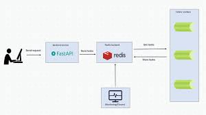
      </td>
    </tr>
    <tr>
      <td align="center"><em>Figure 1: RAG Flow Details</em></td>
      <td align="center"><em>Figure 2: Worker & Monitoring Architecture</em></td>
    </tr>
  </table>
</div>

<div align="center">
  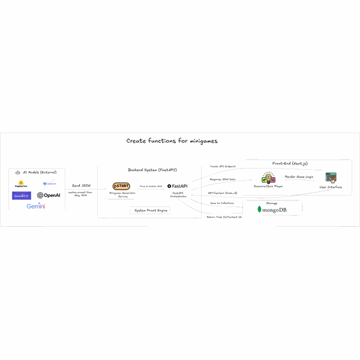
</div>

# 🎓 AI Learning Studio — AI Digital Learning Content Platform

**A production-ready MVP platform that helps teachers and students create smart learning content using AI. Just upload documents, and the system automatically generates slides, podcasts, minigames, and a Q&A chatbot in minutes.**

<div align="center">
  <a href="https://drive.google.com/drive/folders/1jqmgd-Ku9A8Dn8_jNkcK26SXU6ES9OnR">
    
  </a>
  <br/>
  <strong>📂 Slide • Docs • ERD • Pipeline Architecture</strong>
  <br/><br/>
</div>

This is a comprehensive Multimodal RAG (Retrieval-Augmented Generation) AI Agent system, designed with a microservices architecture and fully deployed using **Docker**.

The project is divided into 2 main processing streams:

  * **Chatbot for Students:** A virtual assistant for direct learning support. The system uses an **Advanced RAG Pipeline** (Semantic Chunking, Hybrid Search, Re-ranking) to extract knowledge from documents (PDF, Word, Excel) and answer student questions with high accuracy (citations included).
  * **AI Worker Service:** The heart of the system, processing complex background tasks coordinated by **FastAPI** and managed via **MongoDB**. This module handles multimodal inputs (Whisper STT, OCR), combines web search (Tavily, SerpAPI) to automate the creation of visual learning materials: Lecture Slides, Podcasts, Minigames, and Video/Infographics.

**🛠 Core Technologies:** FastAPI, Next.js 14, MongoDB, ChromaDB (Vector Store), and an advanced AI model ecosystem (Gemini, OpenAI, Groq).


## Key Features

- 📊 **Automatic Slide Generation**: Creates `.pptx` lecture slides from learning materials automatically.
- 🎙️ **Podcast Script Generation**: Creates structured speaker/timeline scripts with TTS support.
- 🎮 **Minigame/Quiz Generation**: Interactive content (MCQ, fill-in-the-blank, flashcards, matching).
- 🤖 **Advanced RAG Chatbot**: Semantic Q&A based on documents using **Hybrid Search** (Vector + BM25) and **FlashRank Re-ranking** for superior accuracy.
- 🧩 **Semantic Chunking**: Intelligent document splitting by semantic context rather than token limits, preserving context.
- 🏁 **Daily Goals**: Automatically tracks learning progress based on schedules with real-time completion percentages.
- 🧭 **Smart Web Search**: Mascot and Chatbot can search the Web (Tavily/Google Search/SerpAPI) to supplement knowledge.
- 🎥 **YouTube Interactive Lesson**: Creates lessons from YouTube videos using **SerpAPI** for fast transcript extraction and interactive questions.
- 🎤 **Multimodal Speech-to-Text**: Supports Whisper (Local) or Groq Cloud (High speed).
- 🔊 **Text-to-Speech**: Natural Vietnamese voice conversion.
- 💻 **Premium AI Terminal**: A beautiful macOS-like console interface to track AI processing progress.
- 📐 **3D Mascot Assistant**: An interactive 3D virtual assistant integrated with Three.js.

> **Note:** MongoDB uses MongoDB Atlas via `MONGO_URI`

 - **Online Web Search**: Integrated web search page for quick information gathering (websites, news, images, videos, books) to help users synthesize information faster.

---

## 1. Technologies Used

### Frontend

| Technology | Description |
|-----------|-------------|
| Next.js 14 | Primary frontend framework with App Router |
| React 18 | Component-based UI building |
| TypeScript | Frontend type safety |
| Tailwind CSS v4 | Utility-first CSS system |
| Framer Motion | Animations and UI interactions |
| Lucide React | Primary icon set |
| React Markdown + Remark GFM | Markdown rendering in UI |
| Three.js + React Three Fiber + Drei | 3D components and interactive mascot |

### Backend & AI

| Technology | Description |
|-----------|-------------|
| Python 3.11+ | Primary language for backend and AI pipeline |
| FastAPI | REST API framework |
| Pydantic / pydantic-settings | Validation schema and application configuration |
| Motor / PyMongo | MongoDB connection and operations |
| ChromaDB | Vector database for local embeddings |
| FlashRank | Re-ranker model for RAG accuracy optimization |
| BM25 (Rank-BM25) | Keyword search algorithm combined with Vector Search |
| OpenAI API | Content generation, embeddings, and fallback model |
| Google Gemini (`google-genai`) | Primary LLM (supports API key rotation) |
| Groq API | High-speed cloud Speech-to-Text |
| SerpAPI | Fast YouTube transcript and metadata extraction |
| Docling / PyPDF / python-docx / pandas / openpyxl / Pillow | Multi-format document processing |
| python-pptx | Automatic PowerPoint slide generation |
| Tavily Search / DuckDuckGo Search / Google Books API | Web and book search |
| Playwright | Browser automation (NotebookLM flow) |

### Data, Queues and Storage

| Technology | Description |
|-----------|-------------|
| MongoDB | Primary business database |
| Redis | Broker and result backend for Celery |
| Celery | Background task processing |
| Flower | Celery worker monitoring |
| MinIO | S3-compatible object storage for local environment |
| Cloudflare R2 | Production object storage for file uploads and generated content |
| Boto3 | MinIO / Cloudflare R2 integration |

### DevOps, Testing and Release

| Technology | Description |
|-----------|-------------|
| Docker / Docker Compose | Deployment, CI smoke test, and service packaging |
| GitHub Actions | CI/CD pipeline |
| GHCR | Publish frontend and backend container images |
| Vitest + Testing Library + jsdom | Frontend unit / integration testing |
| Pytest | Backend testing |
| ESLint | Frontend code quality checks |

### Safe CI/CD Trigger (no `.env` commit)

When you need to trigger the CI/CD pipeline for deployment, you can commit safe documentation or code changes (e.g., README) instead of environment files.

- Do not commit secret files: `.env`, `.env.prod`, `backend/.env`, `frontend/.env.local`.
- Only commit safe changes (docs/code) to trigger the workflow.
- Production secrets should be configured via GitHub Secrets or server env.

Example commit to trigger the pipeline:

```bash
git add README.md
git commit -m "docs: trigger CI/CD deploy"
git push
```

---

## 2. Overall Architecture

### 2.1 Components

- `frontend/` — AI Learning Studio UI (dashboard, upload, materials, slides, podcast, minigame, chatbot)
- `backend/` — REST API, business logic, ingestion pipeline, RAG pipeline
- **Redis** — Message broker for Celery tasks
- **Celery Worker** — Background task execution (generate slides, podcast, minigame)
- **Celery Flower** — Monitoring UI for Celery tasks
- **MinIO / Cloudflare R2** — Object storage for files (uploads, generated content)
- MongoDB — Business data storage (metadata, chunks, generated content, sessions, games)
- ChromaDB — Vector store for semantic search
- OpenAI — For embeddings and generation (if API key available)
- Whisper/Groq — For Speech-to-Text in chatbot

### 2.2 Core Processing Flow

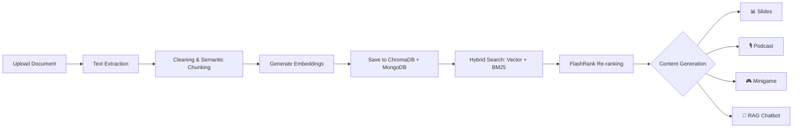
```mermaid
flowchart LR
    A[Upload Document] --> B[Text Extraction]
    B --> C[Cleaning & Semantic Chunking]
    C --> D[Generate Embeddings]
    D --> E[Save to ChromaDB + MongoDB]
    E --> F[Hybrid Search: Vector + BM25]
    F --> G[FlashRank Re-ranking]
    G --> H{Content Generation}
    H --> I[📊 Slides]
    H --> J[🎙️ Podcast]
    H --> K[🎮 Minigame]
    H --> L[🤖 RAG Chatbot]
```

1. User enters or uploads learning material (PDF/DOCX/TXT/MD).
2. Backend reads and extracts text.
3. Content cleaning.
4. Chunking.
5. Create embeddings for each chunk.
6. Save vectors to ChromaDB.
7. Save metadata/chunks to MongoDB.
8. Retrieval by query.
9. Use retrieved context to generate slides, podcast scripts, minigames, and chatbot answers with citations.

### 2.3 Entity Relationship Diagram (ERD)

<div align="center">
  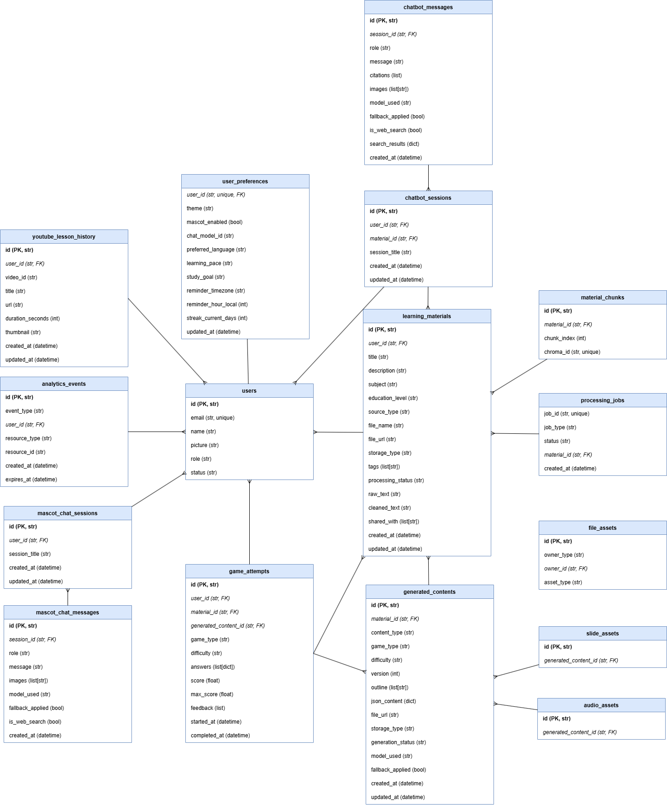
  <p align="center"><em>Figure 3: System Data Structure (ERD)</em></p>
</div>

---

## 3. Directory Structure

```text
AI-FOR-EDUCATION/
├─ backend/                     ← Server Source (FastAPI + AI Pipeline)
│  ├─ app/                      ← Main application logic
│  │  ├─ ai/                    ← AI modules (RAG, Chatbot, Embeddings,...)
│  │  │  ├─ chatbot/            ← Chatbot coordination
│  │  │  ├─ chunking/           ← Document splitting (Semantic vs Text Chunker)
│  │  │  ├─ embeddings/         ← Text to vector
│  │  │  ├─ generation/         ← Content generation (Slides, Podcast, Minigame,...)
│  │  │  ├─ ingestion/          ← Input data ingestion
│  │  │  ├─ parsing/            ← Text extraction (PDF, Word,...)
│  │  │  ├─ retrieval/          ← Retrieval (Hybrid Search + FlashRank Reranker)
│  │  │  └─ vector_store/       ← Vector storage (ChromaDB)
│  │  ├─ api/                   ← REST API Endpoints
│  │  ├─ core/                  ← Configuration, logging
│  │  ├─ db/                    ← Database connections (MongoDB, ChromaDB)
│  │  ├─ models/                ← Database Schemas (Pydantic/Mongo)
│  │  ├─ repositories/          ← Data access layer
│  │  ├─ schemas/               ← API request/response DTOs
│  │  ├─ services/              ← Business logic layer
│  │  │  ├─ storage.py          ← Storage service (MinIO/R2)
│  │  │  ├─ material_service.py ← Material management
│  │  │  ├─ generation_service.py← Auto generation
│  │  │  ├─ chat_service.py     ← RAG chatbot service
│  │  │  ├─ youtube_lesson_service.py ← YouTube processing (SerpAPI)
│  │  │  └─ ...
│  │  ├─ tasks.py               ← Celery background tasks (Slides, Email, Reminders)
│  │  └─ main.py                ← FastAPI entry point
├─ frontend/                    ← UI Source (Next.js + TailwindCSS)
│  ├─ app/                      ← Pages and Layouts (App Router)
│  │  ├─ chatbot/               ← Learning assistant
│  │  ├─ schedule/              ← Progress & Goals
│  │  ├─ materials/             ← Material management
│  │  └─ ...
│  ├─ components/               ← Reusable UI components
│  │  ├─ 3d/                    ← 3D Mascot (Three.js)
│  │  ├─ layout/                ← App structure (Sidebar, AppShell)
│  │  ├─ ui/                    ← Custom UI elements (MacTerminal, Glassy Buttons)
│  │  └─ ...
│  ├─ lib/                      ← API Client, State, Utils
│  ├─ public/                   ← Static assets (3D Models, Icons)
│  ├─ types/                    ← TypeScript types
│  ├─ Dockerfile                ← Frontend Docker config
│  ├─ package.json              ← dependencies
│  └─ .env.example              ← Frontend env template
├─ Document_PRD/                ← Requirement and design docs
├─ image/                       ← README images
├─ markdown_docs/               ← Detailed guides
├─ TESTING_CODE/                ← Sample tests
├─ docker-compose.yml           ← Full stack Docker deployment
├─ README.md                    ← Main README (VN)
└─ .env.example                 ← Root env template
```

---

## 4. Main API (MVP)

> **API Documentation:** [http://localhost:8000/docs](http://localhost:8000/docs) (Swagger UI)

<p align="center">
<table style="margin: 0 auto;">
  <tr>
    <td align="center" style="padding:8px;">
      
      <div style="margin-top:8px; font-weight:600;">Swagger UI — <a href="http://localhost:8000/docs">/docs</a></div>
    </td>
    <td align="center" style="padding:8px;">
      
      <div style="margin-top:8px; font-weight:600;">Health Check — <a href="http://localhost:8000/health">/health</a></div>
    </td>
  </tr>
</table>
</p>

### 4.1 Materials
- `POST /api/materials` — Create material from text
- `POST /api/materials/upload` — Create material from file upload
- `GET /api/materials` — List materials (with pagination)
- `GET /api/materials/{material_id}` — Material details
- `POST /api/materials/{material_id}/process` — Process document (extract, chunk, embedding)
- `DELETE /api/materials/{material_id}` — Delete material
- `POST /api/materials/guardrail-check` — Content guardrail check
- `POST /api/materials/guardrail-check-upload` — Guardrail check for file upload

### 4.2 Generation
- `POST /api/materials/{material_id}/generate/slides` — Generate slides `.pptx`
- `POST /api/materials/{material_id}/generate/podcast` — Generate podcast script
- `POST /api/materials/{material_id}/generate/minigame` — Generate minigame/quiz
- `GET /api/generated-contents/{content_id}` — Get generated content
- `POST /api/notebooklm/generate-media` — NotebookLM media (confirm → download)

### 4.3 Files
- `GET /api/files/{file_path}/download` — Download file
- `GET /api/files/notebooklm/temp/{session_id}/{file_type}/{file_name}/preview` — Preview temp media (video/infographic)

### 4.4 Chat
- `POST /api/chat/{material_id}/session` — New chat session
- `GET /api/chat/sessions/{session_id}` — Get session messages
- `POST /api/chat/sessions/{session_id}/message` — Send message (RAG + image support)
- `POST /api/chat/sessions/{session_id}/web-search` — Web search for chatbot
- `POST /api/chat/mascot/message` — Chat with mascot
- `POST /api/chat/transcribe` — Audio to text
- `POST /api/chat/tts` — Text-to-Speech

### 4.5 Games
- `POST /api/games/{generated_content_id}/submit` — Submit minigame results
- `GET /api/games/attempts/{attempt_id}` — View results

### 4.6 YouTube Interactive Lesson
- `POST /api/youtube-lessons` — Create lesson from YouTube video
- `GET /api/youtube-lessons/{lesson_id}` — Get lesson details
- `POST /api/youtube-lessons/{lesson_id}/translate-transcript` — Translate transcript
- `GET /api/youtube-lessons/history` — Lesson history

---

## 📸 Application Interface

### 1. Overview & Login
<div align="center">
  <table style="width: 100%; border-collapse: collapse;">
    <tr>
      <td style="width: 50%; padding: 5px;">
        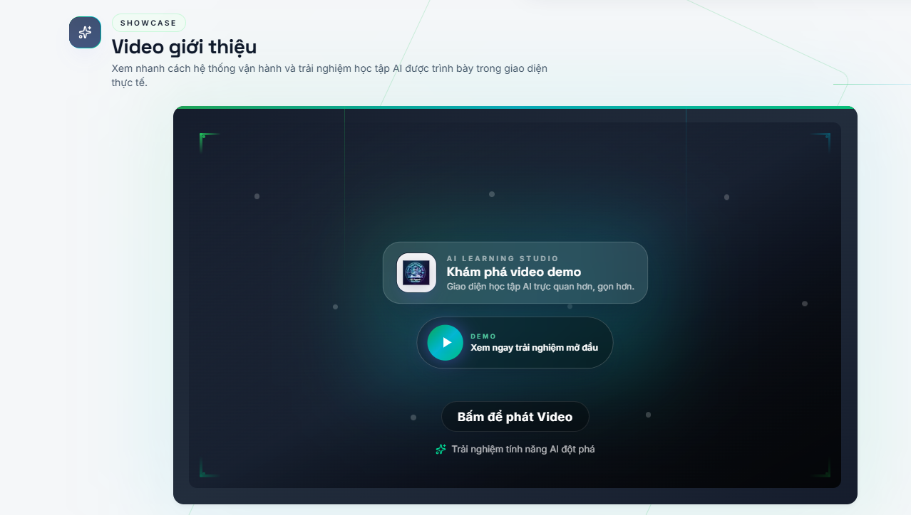
        <p align="center"><em>Introduction Page</em></p>
      </td>
      <td style="width: 50%; padding: 5px;">
        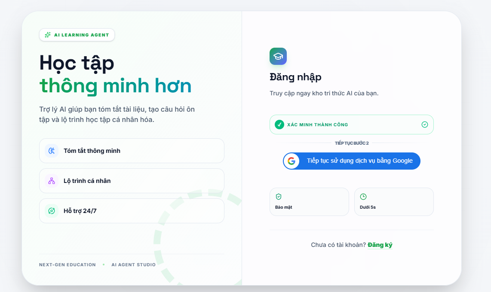
        <p align="center"><em>Login / Register Interface</em></p>
      </td>
    </tr>
  </table>
</div>

### 2. Dashboard & Progress Management
<div align="center">
  <table style="width: 100%; border-collapse: collapse;">
    <tr>
      <td style="width: 50%; padding: 5px;">
        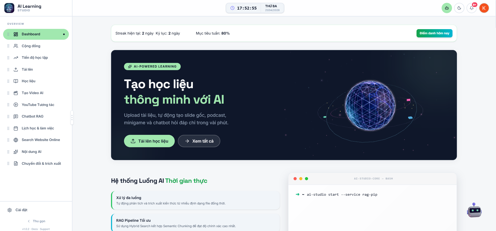
        <p align="center"><em>Main Dashboard with learning stats</em></p>
      </td>
      <td style="width: 50%; padding: 5px;">
        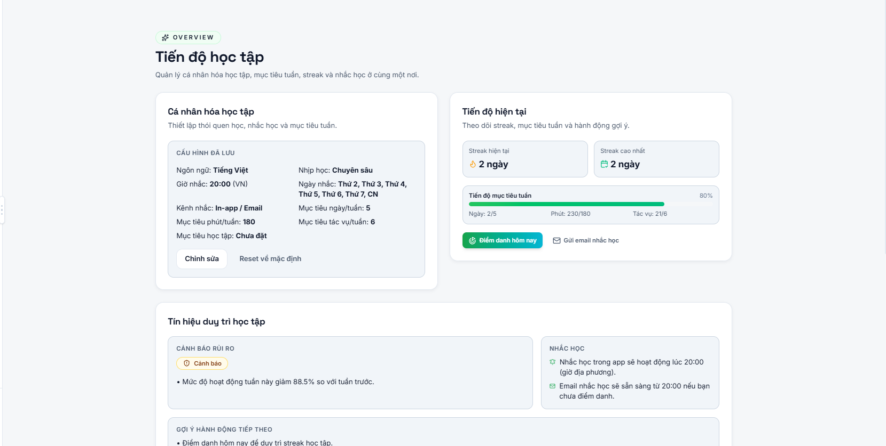
        <p align="center"><em>Streak tracking and Daily Goals</em></p>
      </td>
    </tr>
    <tr>
       <td colspan="2" style="padding: 5px;">
        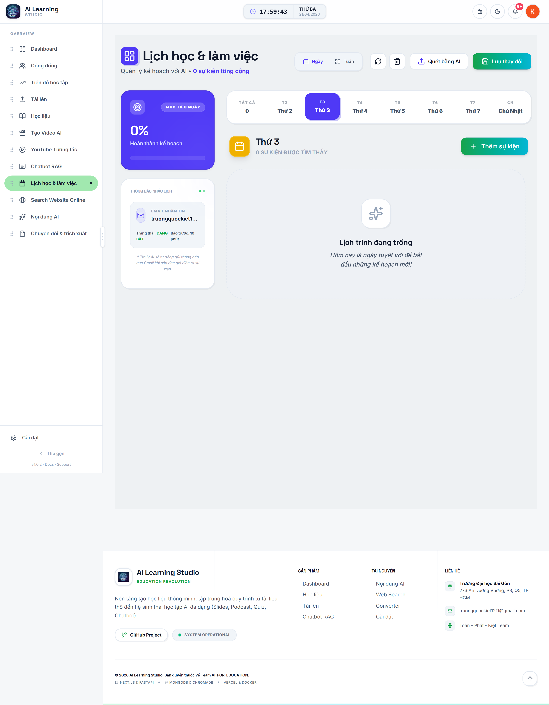
        <p align="center"><em>Smart Learning Schedule</em></p>
      </td>
    </tr>
  </table>
</div>

### 3. Materials Management & Sharing
<div align="center">
  <table style="width: 100%; border-collapse: collapse;">
    <tr>
      <td style="width: 50%; padding: 5px;">
        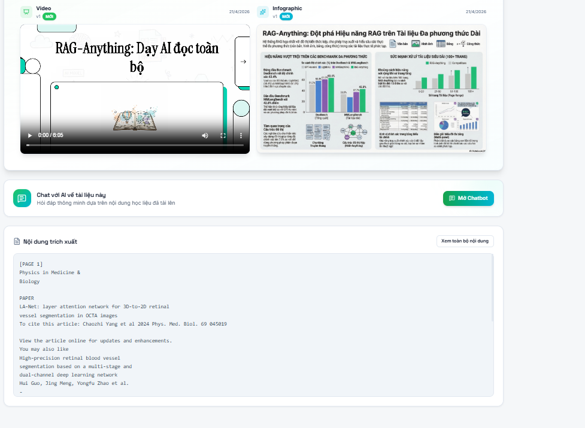
        <p align="center"><em>Digital material management</em></p>
      </td>
      <td style="width: 50%; padding: 5px;">
        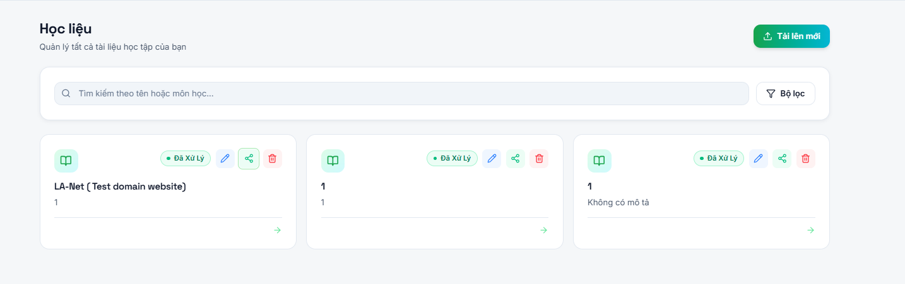
        <p align="center"><em>Document sharing between accounts</em></p>
      </td>
    </tr>
  </table>
</div>

### 4. RAG Chatbot & Advanced AI Tools
<div align="center">
  <table style="width: 100%; border-collapse: collapse;">
    <tr>
      <td colspan="2" style="padding: 5px;">
        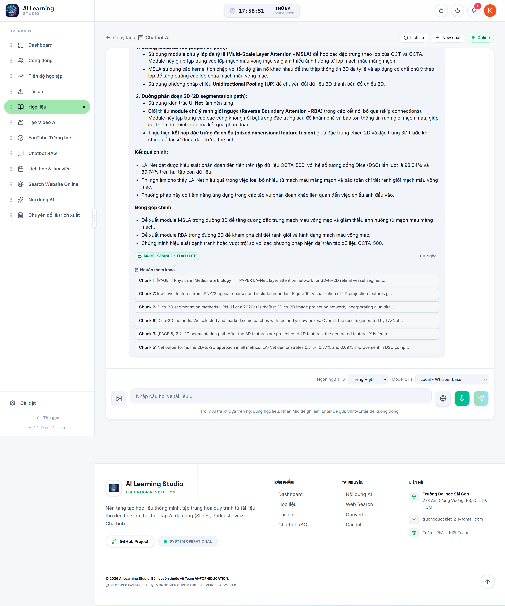
        <p align="center"><em>RAG Chatbot for semantic Q&A based on documents</em></p>
      </td>
    </tr>
    <tr>
      <td style="width: 50%; padding: 5px;">
        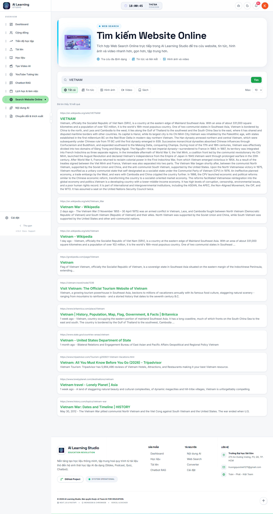
        <p align="center"><em>Integrated Web Search</em></p>
      </td>
      <td style="width: 50%; padding: 5px;">
        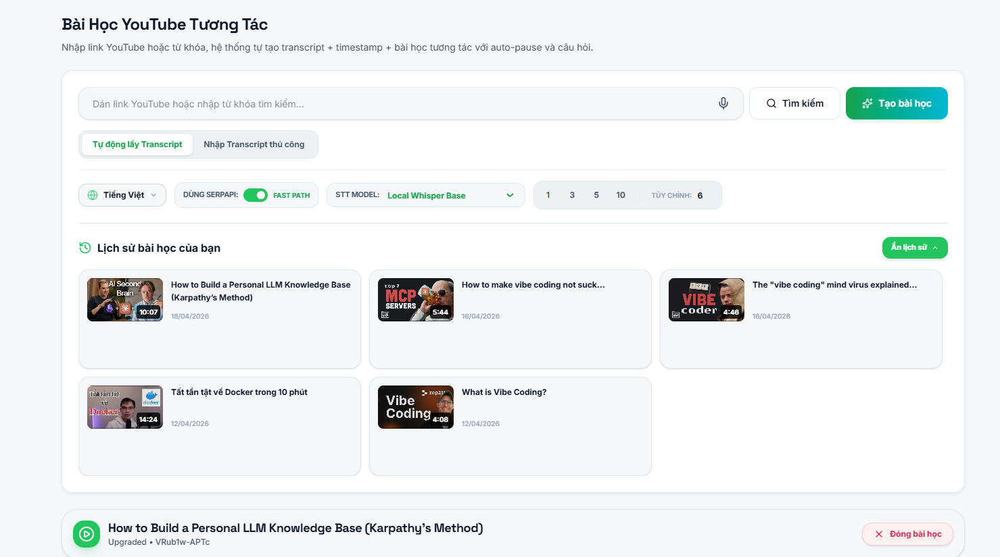
        <p align="center"><em>Interactive lessons from YouTube videos</em></p>
      </td>
    </tr>
  </table>
</div>

### 5. Community & Utilities
<div align="center">
  <table style="width: 100%; border-collapse: collapse;">
    <tr>
      <td style="width: 50%; padding: 5px;">
        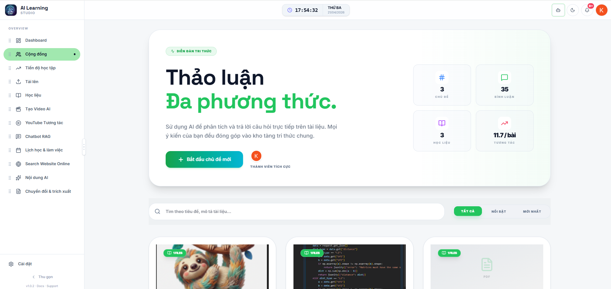
        <p align="center"><em>Community Forum</em></p>
      </td>
      <td style="width: 50%; padding: 5px;">
        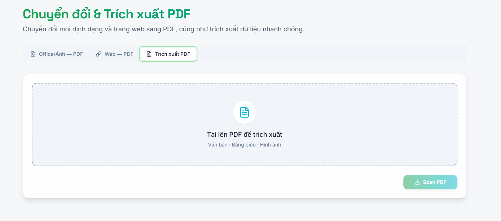
        <p align="center"><em>File processing tools (PDF, Office, Web)</em></p>
      </td>
    </tr>
  </table>
</div>

---


## 🚀 Run the entire system with Docker Compose (Recommended)


*Docker Desktop interface showing all running components: Frontend, Backend, Database (MongoDB, Redis), Storage (Minio), Redis Commander and Celery Workers/Flower.*sss

> 💡 **Storage Note:** Supports **MinIO (local)** and **Cloudflare R2 (production)**. When `USE_OBJECT_STORAGE=true` and `USE_R2=true`, R2 is prioritized;xx if unavailable, falls back to local.

Optimized for Docker with **Hot-reload** on Windows/macOS/Linux.

### ⚙️ Instructions:

#### 1. Prepare Environment File
Create `.env` file in the root directory:ss
```bash
cp .env.docker.example .env
```
Fill in `MONGO_URI` (Atlas recommended) and API Keys (`OPENAI_API_KEY`, `GEMINI_API_KEY`, `GROQ_API_KEY`).

#### 2. Start System
```bash
# With MongoDB Atlas (Default - Lightweight)
docker compose build
docker compose up

# OR With MongoDB Local
docker compose --profile local-db build
docker compose --profile local-db up
```
*Note: Run docker compose build again when Dockerfile or dependencies change.*

#### 3. Access
*   🌐 **Frontend:** [http://localhost:3000](http://localhost:3000)
*   🔧 **Backend API:** [http://localhost:8000](http://localhost:8000)
*   📄 **Swagger Docs:** [http://localhost:8000/docs](http://localhost:8000/docs)
*   🖥️ **Monitor NotebookLM Chrome in Docker:** [http://localhost:6080/vnc.html](http://localhost:6080/vnc.html)

#### Ports and Quick Access

| Service | Host Port | Container Port | Access URL |
|---------|-----------|----------------|------------|
| Frontend | `3000` | `3000` | [http://localhost:3000](http://localhost:3000) |
| Backend API | `8000` | `8000` | [http://localhost:8000](http://localhost:8000) |
| Swagger Docs | `8000` | `8000` | [http://localhost:8000/docs](http://localhost:8000/docs) |
| Health Check | `8000` | `8000` | [http://localhost:8000/health](http://localhost:8000/health) |
| noVNC (NotebookLM Browser) | `6080` | `6080` | [http://localhost:6080/vnc.html](http://localhost:6080/vnc.html) |
| VNC (NotebookLM Browser - native) | `5900` | `5900` | Use VNC client |
| Flower (Celery Monitor) | `5555` | `5555` | [http://localhost:5555](http://localhost:5555) |
| MinIO API | `9000` | `9000` | [http://localhost:9000](http://localhost:9000) |
| MinIO Console | `9001` | `9001` | [http://localhost:9001](http://localhost:9001) |
| Redis | `6379` | `6379` | Redis client |
| Redis Insight (service `redis-commander`) | `8081` | `5540` | [http://localhost:8081](http://localhost:8081) |
| MongoDB (profile `local-db`) | `27017` | `27017` | MongoDB client |
| Grafana (monitoring stack) | `3300` | `3000` | [http://localhost:3300](http://localhost:3300) (User: `admin`, Pass: `yourpassword123`) |
| Prometheus (monitoring stack) | `9090` | `9090` | [http://localhost:9090](http://localhost:9090) |
| Cloudflare R2 | `N/A` | `N/A` | Cloud service |

#### Monitoring NotebookLM Browser in Docker

NotebookLM in Docker runs Chrome in a virtual display. Monitor it via noVNC:

- Open `http://localhost:6080/vnc.html`, click `Connect`, and trigger the NotebookLM workflow.
- If screen is black, reload noVNC or restart backend.
- Detailed docs: [markdown_docs/NOTEBOOKLM_DOCKER_BROWSER_MONITORING.md](markdown_docs/NOTEBOOKLM_DOCKER_BROWSER_MONITORING.md)

#### 4. Stop System
```bash
docker compose down
```

### 💡 Hot-Reload Note:
- **Windows Polling:** Uses `CHOKIDAR_USEPOLLING=true` for NTFS to Linux file change detection.
- **Performance:** WSL2 file system is recommended for best performance.


---

## 5. Detailed Local Setup Guide

### 5.1 Prerequisites
- Windows 10/11 or Linux/macOS
- MongoDB Atlas account
- Python 3.11+
- Node.js 20+ & npm
- FFmpeg (for local Whisper)

Quick Check:
```powershell
py --version
node -v
npm -v
```

### 5.2 Step 1: Prepare MongoDB Atlas
1. Create cluster (M0/M2/M5).
2. Create DB User.
3. Config Network Access.
4. Get SRV connection string.vvvvv

Example:
```text
mongodb+srv://<username>:<password>@<cluster-url>/?retryWrites=true&w=majority&appName=<app-name>......
```

### 5.3 Step 2: Environment Configuration

#### Backend
```powershell
cd backend
copy .env.example .env
```
Fill in `MONGO_URI`, `MONGO_DB_NAME`, `GEMINI_API_KEYS`, etc.

**Gemini API Key Rotation:**
- Multiple keys: `GEMINI_API_KEYS=key1,key2,key3`.
- Single key: `GEMINI_API_KEY=key`.
- Fallback: System automatically switches to OpenAI if Gemini fails.
- Backup: At least 2 keys recommended.

Speech-to-Text Environment Variables:
- `WHISPER_MODEL=base`
- `GROQ_API_KEY=`
- `GROQ_BASE_URL=https://api.groq.com`

#### Frontend
```powershell
cd ..\frontend
copy .env.example .env.local
```
Defaults:
- `NEXT_PUBLIC_API_BASE_URL=http://localhost:8000/api`

### 5.4 Step 3: Dependencies & Run Backend
```powershell
cd ..\backend
pip install -r requirements.txt
python run.py
```
Swagger: `http://localhost:8000/docs`

<p align="center">
<table style="margin: 0 auto;">
  <tr>
    <td align="center" style="padding:8px;">
      
      <div style="margin-top:8px; font-weight:600;">Swagger UI - /docs</div>
    </td>
    <td align="center" style="padding:8px;">
      
      <div style="margin-top:8px; font-weight:600;">Health Check - /health</div>
    </td>
  </tr>
</table>
</p>

### 5.5 Step 4: Dependencies & Run Frontend
```powershell
cd ..\frontend
npm install
npm run dev
```

### 5.6 Copy-Paste Quick Start
Terminal 1 (Backend):
```powershell
cd backend; pip install -r requirements.txt; python run.py
```
Terminal 2 (Frontend):
```powershell
cd frontend; npm install; npm run dev
```

---

## 6. CI / CD

Full CI implementation and practical CD: build artifacts, publish Docker images to GHCR.

- CI Workflow: `.github/workflows/project-ci.yml`
- CD Workflow: `.github/workflows/project-cd.yml`

### 6.1 Overall CI/CD Diagram

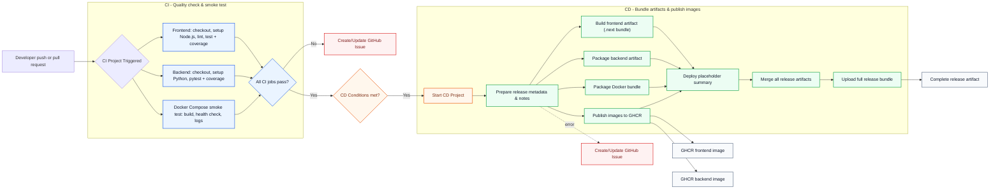
```mermaid
flowchart LR
    A["Developer push or pull request"] --> B{"CI Project Triggered"}

    subgraph CI["CI - Quality check & smoke test"]
        direction TB
        B --> C["Frontend: checkout, setup Node.js, lint, test + coverage"]
        B --> D["Backend: checkout, setup Python, pytest + coverage"]
        B --> E["Docker Compose smoke test: build, health check, logs"]
        C --> F{"All CI jobs pass?"}
        D --> F
        E --> F
    end

    F -->|"No"| G["Create/Update GitHub Issue"]
    F -->|"Yes"| H{"CD Conditions met?"}
    H -->|"Yes"| J["Start CD Project"]

    subgraph CD["CD - Bundle artifacts & publish images"]
        direction TB
        J --> K["Prepare release metadata & notes"]
        K --> L["Build frontend artifact (.next bundle)"]
        K --> M["Package backend artifact"]
        K --> N["Package Docker bundle"]
        K --> O["Publish images to GHCR"]
        L --> P["Deploy placeholder summary"]
        M --> P
        N --> P
        O --> P
        P --> Q["Merge all release artifacts"]
        Q --> R["Upload full release bundle"]
    end

    O --> S["GHCR frontend image"]
    O --> T["GHCR backend image"]
    R --> U["Complete release artifact"]

    K -. error .-> V["Create/Update GitHub Issue"]

    classDef ci fill:#eaf4ff,stroke:#2563eb,stroke-width:1.5px,color:#0f172a;
    classDef cd fill:#ecfdf3,stroke:#16a34a,stroke-width:1.5px,color:#0f172a;
    classDef warn fill:#fff7ed,stroke:#ea580c,stroke-width:1.5px,color:#7c2d12;
    classDef fail fill:#fef2f2,stroke:#dc2626,stroke-width:1.5px,color:#7f1d1d;
    classDef out fill:#f8fafc,stroke:#64748b,stroke-width:1.5px,color:#0f172a;

    class C,D,E,F ci;
    class K,L,M,N,O,P,Q,R cd;
    class H,I,J warn;
    class G,V fail;
    class S,T,U out;
```

### 6.2 Main Jobs and Estimated Time

| Job | Initial Time | Cache Time | Description |
|-----|--------------|------------|-------------|
| **Frontend** | 2-3 min | 1-2 min | Lint + Test + Coverage |
| **Backend** | 1-2 min | 30-60 sec | Pytest + Coverage |
| **Docker Smoke** | 3-5 min | 1-2 min | Build + Health Check |

---

### 6.3 CI/CD GitHub Interface

<div align="center">
  <table style="width: 100%; border-collapse: collapse;">
    <tr>
      <td style="width: 50%; padding: 5px;">
        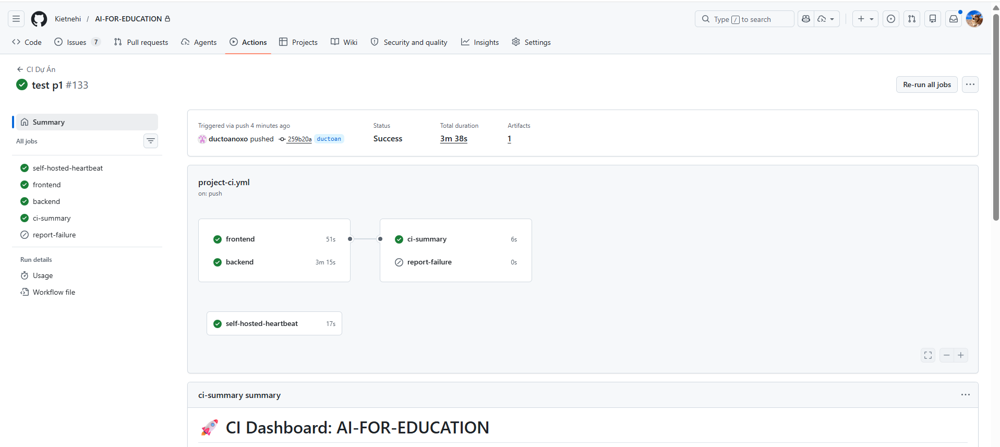
        <p align="center"><em>Figure 4: GitHub Actions Workflow</em></p>
      </td>
      <td style="width: 50%; padding: 5px;">
        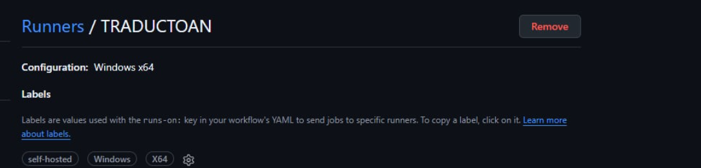
        <p align="center"><em>Figure 5: Runner Status</em></p>
      </td>
    </tr>
    <tr>
      <td style="width: 50%; padding: 5px;">
        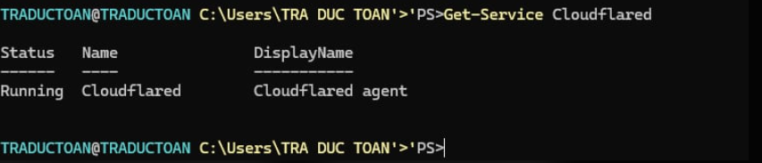
        <p align="center"><em>Figure 6: Successful Pipeline</em></p>
      </td>
      <td style="width: 50%; padding: 5px;">
        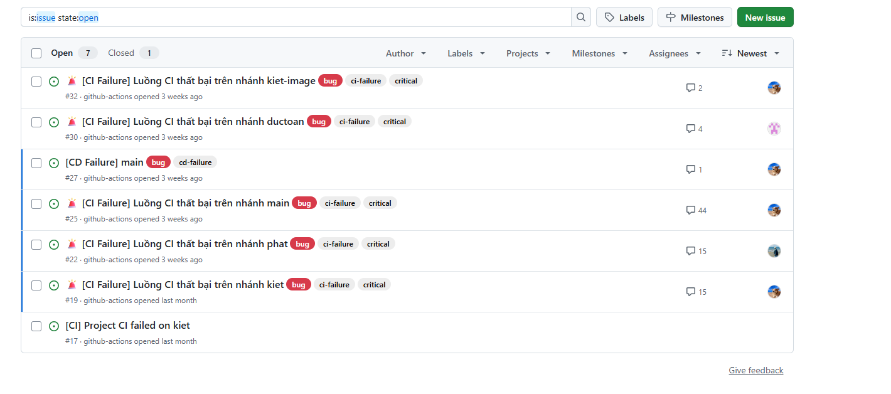
        <p align="center"><em>Figure 7: Auto Issue Creation</em></p>
      </td>
    </tr>
  </table>
</div>

### 6.4 Local CI Testing
```bash
cd frontend; npm run test:ci
cd backend; python -m pytest
docker compose build; docker compose up --exit-code-from backend
```

### 6.5 CD Artifact Download
1. Go to **Actions** tab.
2. Select **CD Project**.
3. Download `full-release-bundle-<sha>` from **Artifacts**.

---

## 6.5 Redis, Celery & Object Storage

### 🔴 Redis - Message Broker
- **Port:** `6379`
- **Role:** Task queue & result backend

### 🍀 Celery - Distributed Tasks
- **Flower:** http://localhost:5555
- **Tasks:** Slides, podcast, minigame

### 📦 Object Storage
- **MinIO Console:** http://localhost:9001 (minioadmin/minioadmin123)
- **Bucket:** `ai-learning-storage`
- **R2:** Production storage

<div align="center">
  <table style="width: 100%; border-collapse: collapse;">
    <tr>
      <td style="width: 33%; padding: 5px;">
        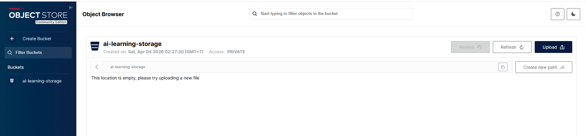
        <p align="center"><em>Figure 12: MinIO Console (Local)</em></p>
      </td>
      <td style="width: 33%; padding: 5px;">
        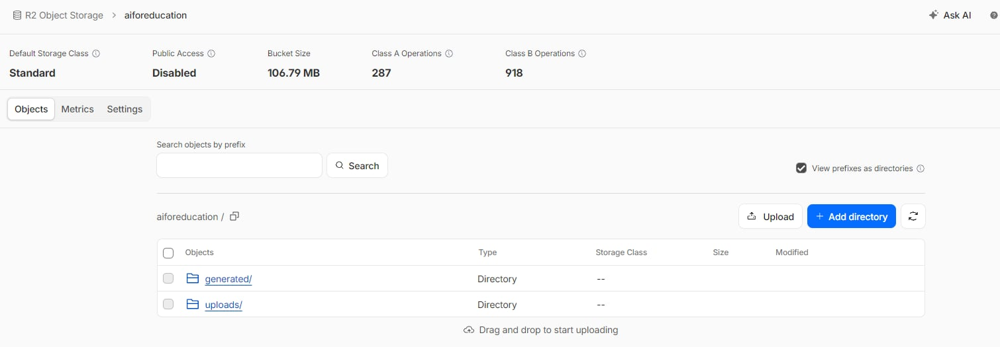
        <p align="center"><em>Figure 13: Cloudflare R2 (Production)</em></p>
      </td>
      <td style="width: 33%; padding: 5px;">
        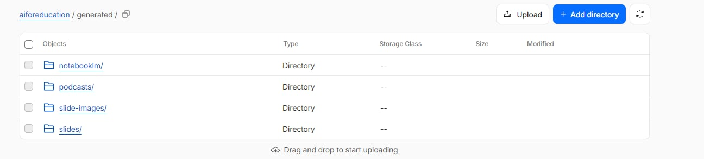
        <p align="center"><em>Figure 14: Generated material files in Storage</em></p>
      </td>
    </tr>
  </table>
</div>

### Quick Commands
```bash
# Redis - Check task results
docker exec any2-redis redis-cli -n 1 KEYS "celery-task-meta-*"
```

---

## 6.7 Monitoring (Prometheus + Grafana)

The system includes a full observability stack to monitor backend performance, logs, and traces.

- **Backend Metrics:** `GET /metrics` (Prometheus format)
- **Grafana:** [http://localhost:3300](http://localhost:3300) (User: `admin`, Pass: `yourpassword123`)
- **Prometheus:** [http://localhost:9090](http://localhost:9090)
- **Loki:** Log aggregation
- **Tempo:** Distributed tracing

<div align="center">
  <table style="width: 100%; border-collapse: collapse;">
    <tr>
      <td style="width: 50%; padding: 5px;">
        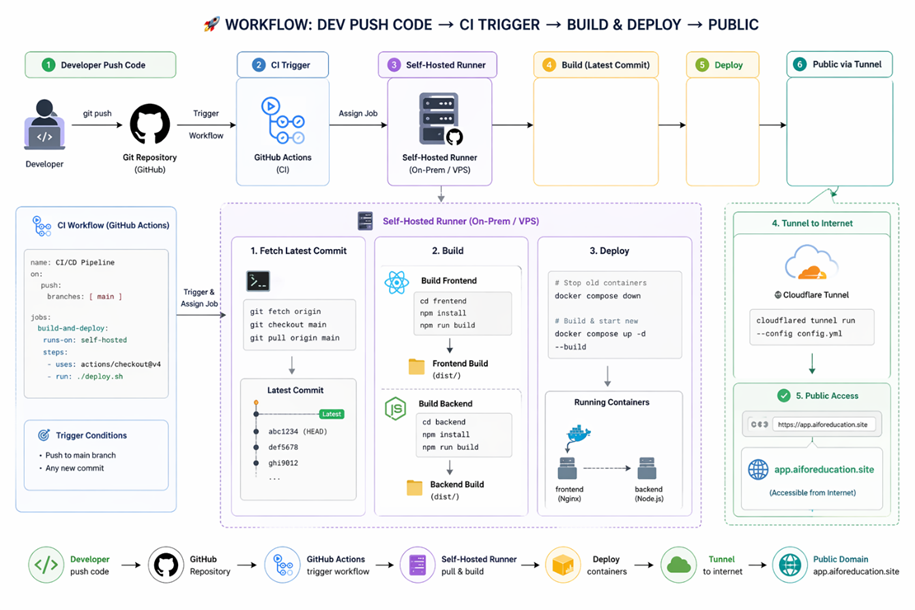
        <p align="center"><em>Full Observability Stack Architecture</em></p>
      </td>
      <td style="width: 50%; padding: 5px;">
        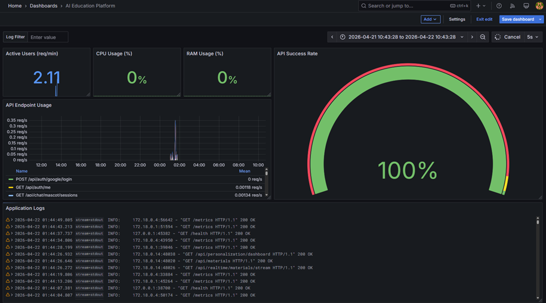
        <p align="center"><em>Prometheus Metrics & Targets</em></p>
      </td>
    </tr>
    <tr>
      <td style="width: 50%; padding: 5px;">
        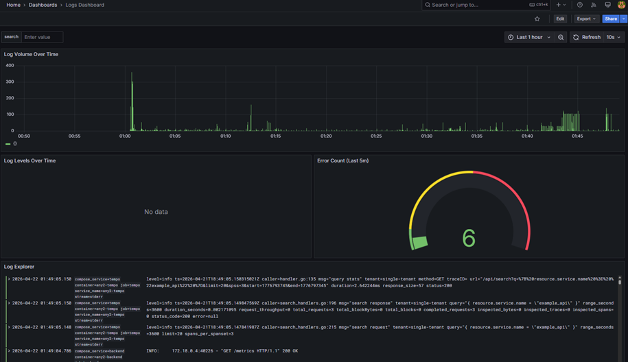
        <p align="center"><em>Loki Log Aggregation in Grafana</em></p>
      </td>
      <td style="width: 50%; padding: 5px;">
        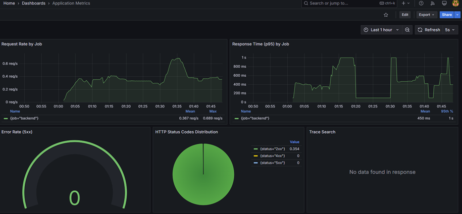
        <p align="center"><em>Tempo Distributed Tracing</em></p>
      </td>
    </tr>
  </table>
</div>

---

## 7. Troubleshooting

- **Missing `python` command:** Use `py` on Windows.
- **MongoDB Atlas connection:** Check credentials and Network Access IP.
- **Frontend-Backend connection:** Check port `8000` and `NEXT_PUBLIC_API_BASE_URL`.
- **Speech-to-Text errors:** Check `GROQ_API_KEY` or FFmpeg install.

---

## Appendix: NotebookLM Video + Infographic

1. Click **Create Video + Infographic** to upload.
2. Click **Confirm and Start** to trigger generation.
3. Click **Download** once complete.
- Headless browser monitoring via noVNC.
- Detailed docs: `markdown_docs/NOTEBOOKLM_DOCKER_BROWSER_MONITORING.md`

---

## Minigame

- Automatic generation from materials.
- Plays & submits results to MongoDB.

---

## 8. Additional Resources & API Keys

### 🔑 API Key Management
- **Google Gemini API:** [Google AI Studio](https://aistudio.google.com/api-keys)
- **OpenAI API:** [OpenAI Platform](https://openai.com/api/)
- **Groq API:** [Groq Cloud](https://console.groq.com/keys)

### 📚 References
- **🚀 Project Google Drive (Slides, Docs, ERD, Pipeline):** [**Access Here**](https://drive.google.com/drive/folders/1jqmgd-Ku9A8Dn8_jNkcK26SXU6ES9OnR)
- **Redis, Celery & Storage:** [Integration Guide](markdown_docs/Redis_Celery_Minio.md).
- **Web Search:** [Web Search Guide (VI)](markdown_docs/WEB_SEARCH_GUIDE_VI.md)

---

## 🔗 Authors & Github Accounts

<p align="center">
  
</p>

| | | | |
| :---: | :---: | :---: | :---: |
| <b><a href="https://github.com/Kietnehi">Trương Phú Kiệt</a></b> | <b><a href="https://github.com/ductoanoxo">Đức Toàn</a></b> | <b><a href="https://github.com/phatle224">Phát Lê</a></b> | <b><a href="https://github.com/nhdotvn">Lê Ngọc Hiệp</a></b> |
| Fullstack Dev & AI Researcher | Developer | Data Engineer | Supporter |

<p align="center">
  <a href="https://github.com/Kietnehi/AI-FOR-EDUCATION">
    
  </a>
</p>

<p align="center">
  
  
</p>

### 🛠 Tech Stack

<p align="center">
  
</p>

### 📘 AI FOR EDUCATION

<p align="center">
  <a href="https://github.com/Kietnehi/AI-FOR-EDUCATION">
    
    
    
  </a>
</p>


<!-- Daily Quote -->
  <p align="center">
    
  </p>

  <p align="center">
  <i>Thank you for stopping by! Don’t forget to give this repo a <b>⭐️ Star</b> if you find it useful.</i>
  </p>

  

  </div>
