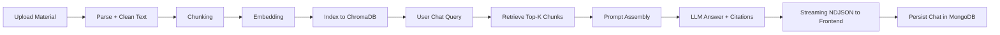

# Full Workflow RAG (Retrieval-Augmented Generation)

Tài liệu này mô tả workflow RAG end-to-end trong AI Learning Studio, từ ingestion dữ liệu đến retrieval, generation, streaming và vận hành production.

Lưu ý review: nội dung đã được đối chiếu lại theo implementation hiện tại (backend/frontend) vào tháng 04/2026.

## 1. Mục tiêu

- Trả lời có context được truy xuất từ học liệu của người dùng.
- Giảm hallucination nhờ grounding trên chunk tài liệu.
- Hỗ trợ chat theo session, citations, và lưu lịch sử MongoDB.
- Vận hành ổn định với fallback LLM và telemetry có thể debug.

## 2. Thành phần kiến trúc (theo layering)

### Backend

- API routes: `backend/app/api/routes/chat.py`, `backend/app/api/routes/materials.py`
- Services: `backend/app/services/chat_service.py`, `backend/app/services/material_service.py`, `backend/app/services/generation_service.py`
- Repositories: `backend/app/repositories/material_repository.py`, `backend/app/repositories/chat_repository.py`, `backend/app/repositories/generated_content_repository.py`
- AI pipeline:
  - Parsing: `backend/app/ai/parsing/file_parser.py`
  - Cleaning: `backend/app/ai/ingestion/text_cleaner.py`
  - Chunking: `backend/app/ai/chunking/text_chunker.py`
  - Embedding: `backend/app/ai/embeddings/openai_embedder.py`
  - Vector store: `backend/app/ai/vector_store/chroma_store.py`
  - Retrieval: `backend/app/ai/retrieval/retriever.py`
  - Orchestration chat RAG: `backend/app/ai/chatbot/orchestrator.py`
  - LLM fallback và generation client: `backend/app/ai/generation/llm_client.py`

### Data stores

- MongoDB: metadata (materials, chats, generated content, jobs)
- ChromaDB: vector index cho retrieval
- Filesystem storage (config trong `backend/app/core/config.py`): uploads/generated/chroma/images/notebooklm

### Frontend

- Materials UI: `frontend/app/materials/page.tsx`, `frontend/app/materials/upload/page.tsx`
- Chat UI: `frontend/app/materials/[id]/chat/page.tsx`
- API helper: `frontend/lib/api.ts`

## 3. Luồng tổng quan

## 4. Workflow chi tiết

## 4.1 Ingestion và indexing (offline/near-realtime)

1. Người dùng upload học liệu qua materials flow (hiện hỗ trợ trực tiếp: PDF, DOCX, TXT, MD).
2. Hệ thống parse file thành plain text + metadata.
3. Text được clean để loại bỏ noise, ký tự lỗi, normalize khoảng trắng.
4. Chunking chia text thành đoạn có overlap để tối ưu retrieval.
5. Mỗi chunk được embedding thành vector.
6. Vector + metadata chunk được upsert vào ChromaDB collection theo material.
7. Metadata tổng quan (material, file asset, trạng thái) được lưu MongoDB.

Kết quả: material sẵn sàng cho truy vấn RAG.

## 4.2 Query-time retrieval (online)

1. User gửi câu hỏi trong chat session.
2. Orchestrator tạo query embedding.
3. Retriever tìm top-k chunk từ Chroma theo similarity.
4. Ở implementation hiện tại, truy vấn vector áp dụng filter theo `material_id`.
5. User scope được đảm bảo ở tầng session/material ownership (route/service), không phải filter trực tiếp trong Chroma query.
6. Tạo context window gồm các chunk + snippet cho citation.

Kết quả: có bộ context có liên quan cao nhất để đưa vào prompt.

## 4.3 Prompt assembly và generation

1. Hệ thống tạo system instruction (vai trò gia sư, style học tập, ràng buộc).
2. Ghép user question + retrieved context + lịch sử hội thoại gần đây (theo `settings.chat_memory_turns`).
3. Gọi LLM qua `LLMClient`:
  - Ưu tiên Gemini theo thứ tự model và key rotation.
  - Nếu Gemini fail toàn bộ thì fallback OpenAI.
  - Với câu trả lời RAG khi không chọn custom model (default route), nhánh stream dùng chiến lược non-stream ở tầng LLM (trả 1 content chunk), vẫn đóng gói dưới NDJSON.
4. Trích xuất metadata phản hồi:
   - `model_used`
   - `fallback_applied`
  - citations chunks được dùng

Kết quả: answer đã được grounding và có khả năng truy vết nguồn.

## 4.4 Streaming phản hồi

- Endpoint stream trả về `application/x-ndjson`.
- Trình tự chunk điển hình:
  - citations chunk (được gửi trước)
  - content/reasoning chunk
  - done chunk (`done: true`, kèm `model`)
- Lưu ý hành vi thực tế:
  - Default model RAG: thường trả content theo 1 chunk lớn (không token-by-token realtime).
  - Custom model (OpenAI-compatible): có thể trả delta streaming theo nhiều chunk.
- Frontend trong `frontend/lib/api.ts` đọc stream theo từng dòng JSON và cộng dồn vào message hiện tại.

Kết quả: user thấy nội dung ra dần thay vì chờ toàn bộ câu trả lời.

## 4.5 Persist chat và observability

1. Sau khi stream xong, backend ghi assistant message hoàn chỉnh vào MongoDB.
2. Lưu kèm citations, `model_used`, reasoning details (nếu có).
3. Khác biệt theo endpoint:
  - Non-stream endpoint lưu thêm `fallback_applied`.
  - Stream endpoint hiện không lưu `fallback_applied` trong message assistant.
4. Logging bao gồm thời gian phản hồi, model và fallback state để debug.

Kết quả: có audit trail đầy đủ cho chat và để theo dõi chất lượng RAG.

## 5. Contract dữ liệu khuyến nghị cho RAG

Mỗi chunk trong vector store nên có metadata tối thiểu:

- `material_id`
- `chunk_index`
- `source_type` (pdf, docx, transcript, web, ...)
- `source_ref` (tên file, page, timestamp)
- `created_at`
- `language`

Ghi chú implementation hiện tại:

- Metadata chunk đang upsert vào Chroma tối thiểu gồm `material_id`, `chunk_index`.
- Các trường như `source_type`, `source_ref`, `language` là hướng mở rộng nên bổ sung nếu cần tracing sâu hơn.

Mỗi answer trả về frontend nên có:

- `message`
- `citations[]` (chứa snippet + source_ref)
- `model_used`
- `fallback_applied`

Ghi chú implementation hiện tại:

- Stream trả NDJSON chunks (`citations`/`content`/`reasoning`/`done` + `model`).
- Non-stream trả object message hoàn chỉnh và có thể gồm `fallback_applied`.

## 6. Cấu hình và vận hành

- CORS backend phải cho phép frontend origin (local mặc định: `http://localhost:3000`).
- Biến frontend cho browser phải có prefix `NEXT_PUBLIC_`.
- Đường dẫn storage cần writable theo `backend/app/core/config.py`.
- Nếu Mongo password có ký tự đặc biệt, cần URL-encode trong `MONGO_URI`.
- Không loại bỏ fallback path Gemini -> OpenAI nếu chưa có yêu cầu đặc biệt.

## 7. Chỉ số chất lượng cần theo dõi

- Retrieval recall@k trên bộ query đánh giá nội bộ.
- Citation precision: tỉ lệ citation đúng nguồn/nội dung.
- Answer groundedness: tỉ lệ câu trả lời bám sát context.
- Latency:
  - time-to-first-chunk
  - full-response latency
- Fallback rate (Gemini -> OpenAI).

## 8. Failure modes thường gặp và cách xử lý

- Empty retrieval (không có chunk liên quan):
  - Hiện tại hệ thống trả thông báo không đủ dữ liệu và citations rỗng.
  - Có thể cải thiện bằng tăng k, điều chỉnh chunk size/overlap, bổ sung keyword expansion.
- Context drift (chunk retrieval đúng nhưng trả lời lệch):
  - Siết system instruction và format prompt context.
- High latency:
  - Giảm context length, tối ưu top-k, cache embedding/query phù hợp.
- Hallucination:
  - Bắt buộc citation, từ chối trả lời nếu confidence retrieval thấp.

## 9. Checklist end-to-end trước khi release

1. Upload material mới và xác nhận chunk/index thành công.
2. Chạy 5-10 query mẫu, kiểm tra citations có đúng source.
3. Test stream UI và non-stream fallback.
4. Kiểm tra `model_used` được trả về và lưu DB ở cả 2 nhánh.
5. Kiểm tra `fallback_applied` ở nhánh non-stream (và quyết định có cần bổ sung cho nhánh stream hay không).
6. Kiểm tra logs khi gặp lỗi timeout/rate-limit.
7. Chạy test liên quan backend + frontend trước merge.

## 10. Mở rộng đề xuất

- Hybrid retrieval (BM25 + dense vector) để cải thiện recall.
- Re-ranking top chunks trước khi lập prompt.
- Query rewriting theo mục tiêu học tập (age/level).
- Material-aware caching cho query lặp lại.
- Evaluation pipeline tự động (regression benchmark cho RAG).

## 11. Review nhanh chatbot RAG (theo code hiện tại)

Điểm ổn:

- Layering route -> service -> repository được giữ đúng cho chat flow.
- RAG context có citation rõ ràng (`chunk_id`, `chunk_index`, `snippet`).
- Có Gemini key rotation + model fallback + OpenAI fallback.

Rủi ro/điểm cần cân nhắc:

- Stream nhánh default hiện không token-stream thực sự (UX vẫn là NDJSON nhưng thường nhận 1 content chunk lớn).
- `fallback_applied` chưa được persist ở nhánh stream, gây lệch telemetry giữa 2 endpoint.
- Retrieval filter vector mới theo `material_id`; chưa có thêm các chiều filter metadata khác trong Chroma query.

---

Tài liệu này là bản hướng dẫn workflow tổng thể. Nếu cần chi tiết API fallback và streaming, xem thêm:

- `markdown_docs/LLM_API_FLOW.md`
- `markdown_docs/REASONING_STREAMING.md`
- `markdown_docs/STORAGE_AND_MEDIA_FIXES.md`
