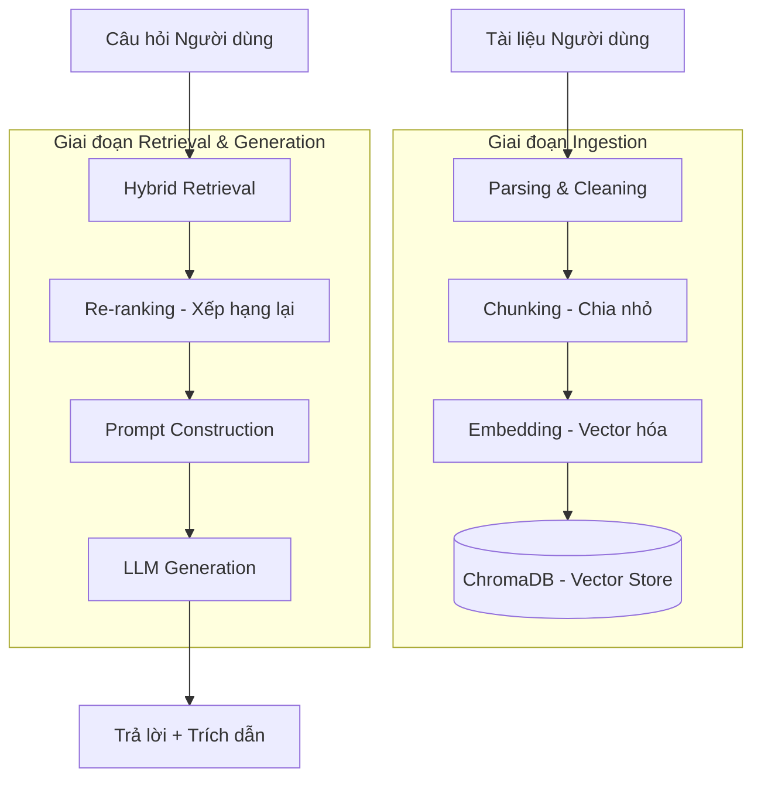

# Hệ thống RAG (Retrieval-Augmented Generation) - AI Learning Studio

Chào mừng bạn đến với tài liệu kỹ thuật về hệ thống **RAG (Retrieval-Augmented Generation)** của dự án **AI Learning Studio**. Đây là trái tim của nền tảng, giúp trợ lý AI cung cấp câu trả lời chính xác, đáng tin cậy và bám sát nội dung học tập của người dùng.

---

## 1. Tổng quan về RAG
RAG là kỹ thuật kết hợp giữa khả năng ngôn ngữ mạnh mẽ của LLM (Large Knowledge Model) và kho dữ liệu riêng biệt của người dùng. Thay vì chỉ dựa vào kiến thức có sẵn trong mô hình (có thể bị cũ hoặc sai lệch), RAG cho phép AI "đọc" và "tra cứu" tài liệu bạn tải lên trước khi trả lời.

### Lợi ích chính:
- **Giảm Hallucination (Ảo giác):** AI chỉ trả lời dựa trên những gì có trong tài liệu.
- **Cập nhật kiến thức:** Không cần training lại mô hình, chỉ cần cập nhật tài liệu.
- **Minh bạch:** Có trích dẫn (citations) cụ thể giúp người dùng kiểm chứng.

---

## 2. Kiến trúc Hệ thống RAG

Hệ thống của chúng tôi sử dụng mô hình **Hybrid Search** kết hợp với **Re-ranking** để đảm bảo độ chính xác cao nhất.

### Workflow tổng quát:

---

## 3. Các thành phần chi tiết

### 3.1. Xử lý dữ liệu (Ingestion)
- **Parsing:** Hỗ trợ đa dạng định dạng file (PDF, Word, TXT, Markdown). Sử dụng OCR cho các tài liệu quét qua `ocr_space_parser.py`.
- **Semantic Chunking:** Chia nhỏ tài liệu thành các đoạn (chunks) có ý nghĩa hoàn chỉnh qua `semantic_chunker.py`, tránh việc cắt ngang câu làm mất ngữ cảnh.
- **Vector Storage:** Sử dụng **ChromaDB** (`chroma_store.py`) để lưu trữ các vector embedding của từng đoạn văn bản.

### 3.2. Công cụ tìm kiếm (Retrieval)
Chúng tôi sử dụng mô hình tìm kiếm lai (**Hybrid Search**) trong `retriever.py`:
1. **Vector Search:** Tìm các đoạn văn bản có *ý nghĩa* tương đồng với câu hỏi (sử dụng `OpenAIEmbedder`).
2. **BM25 Search (Keyword):** Tìm các đoạn chứa *từ khóa* chính xác qua `BM25Retriever`.
3. **Hybrid Search:** Kết hợp kết quả từ cả hai phương pháp để tối ưu hóa cả về ngữ nghĩa và từ khóa.

### 3.3. Xếp hạng lại (Re-ranking)
Sau khi lấy ra các kết quả sơ bộ, hệ thống sử dụng `DocumentReranker` để tinh lọc:
- **FlashRank:** Một mô hình Cross-Encoder nhẹ để đánh giá lại độ liên quan thực sự.
- **LLM Reranking (Fallback):** Nếu mô hình local gặp sự cố, Gemini sẽ trực tiếp tham gia đánh giá mức độ liên quan.

### 3.4. Sinh câu trả lời (Generation)
- **Context Window:** Các đoạn văn bản tốt nhất được đưa vào prompt làm "bối cảnh".
- **System Prompt:** Được thiết kế nghiêm ngặt để AI luôn bám sát tài liệu và trả lời bằng tiếng Việt.
- **Multi-modal:** Hỗ trợ hình ảnh trong chat giúp phân tích các biểu đồ, sơ đồ trong tài liệu.

---

## 4. Các tính năng nâng cao

### 🔄 Gemini Key Rotation & Fallback
Hệ thống sử dụng `LLMClient` để quản lý:
1. **Gemini Rotation:** Tự động xoay vòng giữa nhiều API key để tránh giới hạn rate limit.
2. **Model Fallback:** Tự động chuyển đổi giữa Gemini và OpenAI GPT để đảm bảo dịch vụ không bị gián đoạn.

### ⚡ Streaming Response
Hỗ trợ streaming qua NDJSON, giúp người dùng nhận được phản hồi ngay lập tức khi AI đang tạo nội dung.

### 📚 Citations (Trích dẫn)
Mỗi câu trả lời đều đi kèm `citations` chứa:
- Snippet của đoạn văn bản gốc.
- Index của chunk để dễ dàng đối chiếu.

---

## 5. Hướng dẫn Tối ưu hóa RAG

Để nhận được câu trả lời tốt nhất từ AI, bạn nên:
1. **Tài liệu sạch:** Đảm bảo file PDF/Word không bị lỗi font hoặc dàn trang quá phức tạp.
2. **Câu hỏi cụ thể:** Thay vì hỏi "Nói về chương 1", hãy hỏi "Các định nghĩa chính về kinh tế học trong chương 1 là gì?".
3. **Sử dụng Reasoning:** Bật chế độ "Reasoning" để AI suy luận sâu hơn từ các dữ liệu được truy xuất.

---

*Tài liệu này được soạn thảo để cung cấp cái nhìn tổng quan về sức mạnh công nghệ AI đằng sau AI Learning Studio.*
